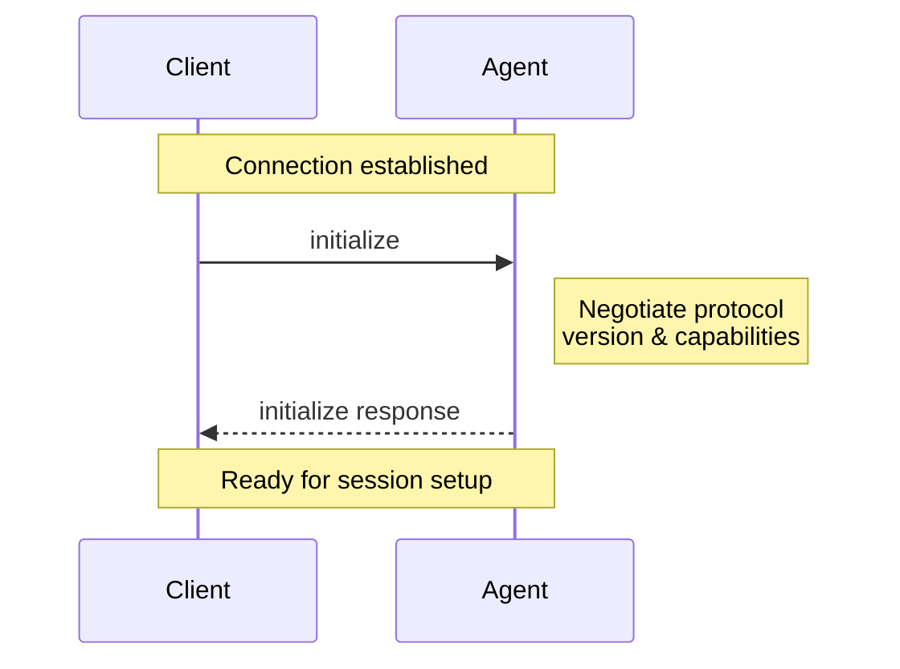
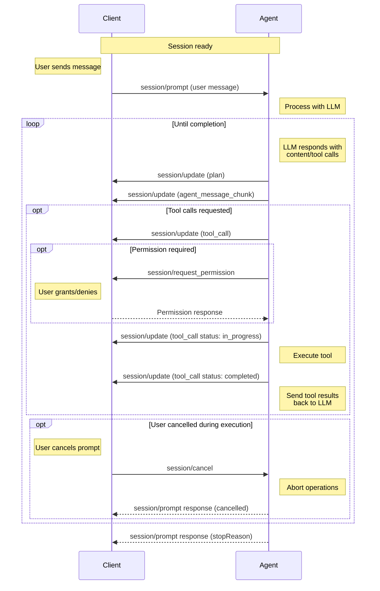
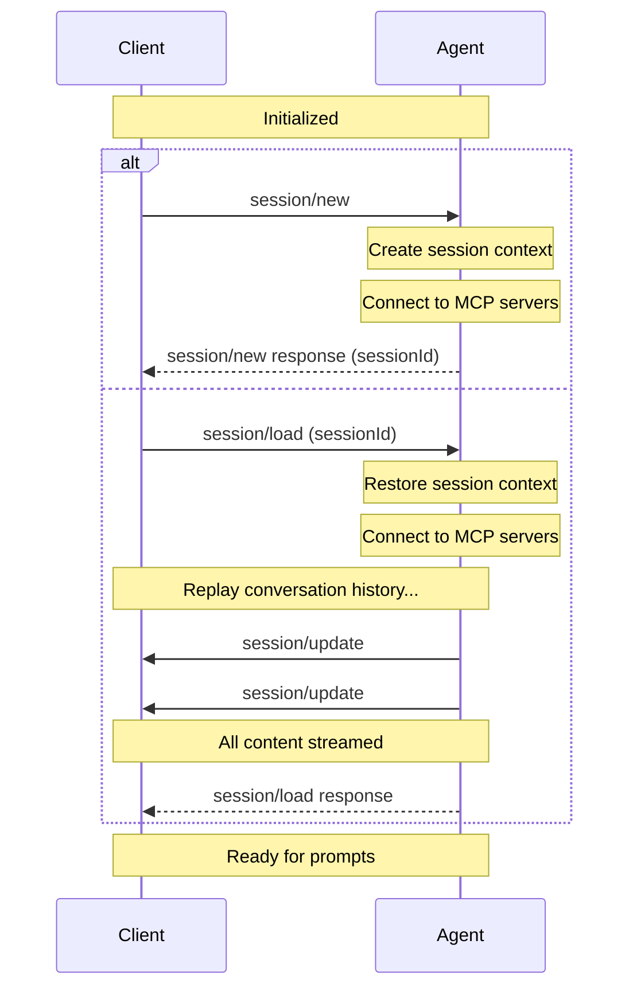

# Contributing
Source: https://agentclientprotocol.com/community/contributing

How to participate in the development of ACP

We welcome contributions from the community!

All contributors must adhere to [Zed's Code of Conduct](https://zed.dev/code-of-conduct).

For questions and discussions, please use GitHub Discussions.


# Community
Source: https://agentclientprotocol.com/libraries/community

Community managed libraries for the Agent Client Protocol

## Dart

* [acp\_dart](https://github.com/SkrOYC/acp-dart)

## Emacs

* [acp.el](https://github.com/xenodium/acp.el)

## Python

* [agent-client-protocol-python](https://github.com/PsiACE/agent-client-protocol-python)

## React

* [use-acp](https://github.com/marimo-team/use-acp)


# Rust
Source: https://agentclientprotocol.com/libraries/rust

Rust library for the Agent Client Protocol

The [agent-client-protocol](https://crates.io/crates/agent-client-protocol) Rust
crate provides implementations of both sides of the Agent Client Protocol that
you can use to build your own agent server or client.

To get started, add the crate as a dependency to your project's `Cargo.toml`:

```bash
cargo add agent-client-protocol
```

Depending on what kind of tool you're building, you'll need to implement either
the
[Agent](https://docs.rs/agent-client-protocol/latest/agent_client_protocol/trait.Agent.html)
trait or the
[Client](https://docs.rs/agent-client-protocol/latest/agent_client_protocol/trait.Client.html)
trait to define the interaction with the ACP counterpart.

The
[agent](https://github.com/zed-industries/agent-client-protocol/blob/main/rust/examples/agent.rs)
and
[client](https://github.com/zed-industries/agent-client-protocol/blob/main/rust/examples/client.rs)
example binaries provide runnable examples of how to do this, which you can use
as a starting point.

You can read the full documentation for the `agent-client-protocol` crate on
[docs.rs](https://docs.rs/agent-client-protocol/latest/agent_client_protocol/).

## Users

The `agent-client-protocol` crate powers the integration with external agents in
the [Zed](https://zed.dev) editor.


# TypeScript
Source: https://agentclientprotocol.com/libraries/typescript

TypeScript library for the Agent Client Protocol

The [@zed-industries/agent-client-protocol](https://www.npmjs.com/package/@zed-industries/agent-client-protocol) npm
package provides implementations of both sides of the Agent Client Protocol that
you can use to build your own agent server or client.

To get started, add the package as a dependency to your project:

```bash
npm install @zed-industries/agent-client-protocol
```

Depending on what kind of tool you're building, you'll need to use either the
[AgentSideConnection](https://zed-industries.github.io/agent-client-protocol/classes/AgentSideConnection.html)
class or the
[ClientSideConnection](https://zed-industries.github.io/agent-client-protocol/classes/ClientSideConnection.html)
class to establish communication with the ACP counterpart.

You can find example implementations of both sides in the [main repository](https://github.com/zed-industries/agent-client-protocol/tree/main/typescript/examples). These can be run from your terminal or from an ACP Client like [Zed](https://zed.dev), making them great starting points for your own integration!

Browse the [TypeScript library reference](https://zed-industries.github.io/agent-client-protocol) for detailed API documentation.

For a complete, production-ready implementation of an ACP agent, check out [Gemini CLI](https://github.com/google-gemini/gemini-cli/blob/main/packages/cli/src/zed-integration/zedIntegration.ts).


# Agents
Source: https://agentclientprotocol.com/overview/agents

Agents implementing the Agent Client Protocol

The following agents can be used with an ACP Client:

* [Claude Code](https://docs.anthropic.com/en/docs/claude-code/overview)
  * [via Zed's SDK adapter](https://github.com/zed-industries/claude-code-acp)
* [Gemini](https://github.com/google-gemini/gemini-cli)
* [Goose](https://block.github.io/goose/docs/guides/acp-clients)
* [JetBrains Junie *(coming soon)*](https://www.jetbrains.com/junie/)
* [Stakpak](https://github.com/stakpak/agent?tab=readme-ov-file#agent-client-protocol-acp)
* [VT Code](https://github.com/vinhnx/vtcode/blob/main/README.md#zed-ide-integration-agent-client-protocol)


# Architecture
Source: https://agentclientprotocol.com/overview/architecture

Overview of the Agent Client Protocol architecture

The Agent Client Protocol defines a standard interface for communication between AI agents and client applications. The architecture is designed to be flexible, extensible, and platform-agnostic.

## Design Philosophy

The protocol architecture follows several key principles:

1. **MCP-friendly**: The protocol is built on JSON-RPC, and re-uses MCP types where possible so that integrators don't need to build yet-another representation for common data types.
2. **UX-first**: It is designed to solve the UX challenges of interacting with AI agents; ensuring there's enough flexibility to render clearly the agents intent, but is no more abstract than it needs to be.
3. **Trusted**: ACP works when you're using a code editor to talk to a model you trust. You still have controls over the agent's tool calls, but the code editor gives the agent access to local files and MCP servers.

## Setup

When the user tries to connect to an agent, the editor boots the agent sub-process on demand, and all communication happens over stdin/stdout.

Each connection can support several concurrent sessions, so you can have multiple trains of thought going on at once.


ACP makes heavy use of JSON-RPC notifications to allow the agent to stream updates to the UI in real-time. It also uses JSON-RPC's bidirectional requests to allow the agent to make requests of the code editor: for example to request permissions for a tool call.

## MCP

Commonly the code editor will have user-configured MCP servers. When forwarding the prompt from the user, it passes configuration for these to the agent. This allows the agent to connect directly to the MCP server.


The code editor may itself also wish to export MCP based tools. Instead of trying to run MCP and ACP on the same socket, the code editor can provide its own MCP server as configuration. As agents may only support MCP over stdio, the code editor can provide a small proxy that tunnels requests back to itself:


# Clients
Source: https://agentclientprotocol.com/overview/clients

Clients implementing the Agent Client Protocol

The following clients can be used with an ACP Agent:

* [Zed](https://zed.dev/docs/ai/external-agents)
* [JetBrains *(coming soon)*](https://blog.jetbrains.com/ai/2025/10/jetbrains-zed-open-interoperability-for-ai-coding-agents-in-your-ide/)
* Emacs via [agent-shell.el](https://github.com/xenodium/agent-shell)
* [marimo notebook](https://github.com/marimo-team/marimo)
* [neovim](https://neovim.io)
  * through the [CodeCompanion](https://github.com/olimorris/codecompanion.nvim) plugin
  * through the [yetone/avante.nvim](https://github.com/yetone/avante.nvim) plugin


# Introduction
Source: https://agentclientprotocol.com/overview/introduction

Get started with the Agent Client Protocol (ACP)

The Agent Client Protocol standardizes communication between code editors (IDEs, text-editors, etc.) and coding agents (programs that use generative AI to autonomously modify code).

The protocol is still under development, but it should be complete enough to build interesting user experiences using it.

## Why ACP?

AI coding agents and editors are tightly coupled but interoperability isn't the default. Each editor must build custom integrations for every agent they want to support, and agents must implement editor-specific APIs to reach users.
This creates several problems:

* Integration overhead: Every new agent-editor combination requires custom work
* Limited compatibility: Agents work with only a subset of available editors
* Developer lock-in: Choosing an agent often means accepting their available interfaces

ACP solves this by providing a standardized protocol for agent-editor communication, similar to how the [Language Server Protocol (LSP)](https://microsoft.github.io/language-server-protocol/) standardized language server integration.

Agents that implement ACP work with any compatible editor. Editors that support ACP gain access to the entire ecosystem of ACP-compatible agents.
This decoupling allows both sides to innovate independently while giving developers the freedom to choose the best tools for their workflow.

## Overview

ACP assumes that the user is primarily in their editor, and wants to reach out and use agents to assist them with specific tasks.

Agents run as sub-processes of the code editor, and communicate using JSON-RPC over stdio. The protocol re-uses the JSON representations used in MCP where possible, but includes custom types for useful agentic coding UX elements, like displaying diffs.

The default format for user-readable text is Markdown, which allows enough flexibility to represent rich formatting without requiring that the code editor is capable of rendering HTML.


# Agent Plan
Source: https://agentclientprotocol.com/protocol/agent-plan

How Agents communicate their execution plans

Plans are execution strategies for complex tasks that require multiple steps.

Agents may share plans with Clients through [`session/update`](./prompt-turn#3-agent-reports-output) notifications, providing real-time visibility into their thinking and progress.

## Creating Plans

When the language model creates an execution plan, the Agent **SHOULD** report it to the Client:

```json
{
  "jsonrpc": "2.0",
  "method": "session/update",
  "params": {
    "sessionId": "sess_abc123def456",
    "update": {
      "sessionUpdate": "plan",
      "entries": [
        {
          "content": "Analyze the existing codebase structure",
          "priority": "high",
          "status": "pending"
        },
        {
          "content": "Identify components that need refactoring",
          "priority": "high",
          "status": "pending"
        },
        {
          "content": "Create unit tests for critical functions",
          "priority": "medium",
          "status": "pending"
        }
      ]
    }
  }
}
```

<ParamField path="entries" type="PlanEntry[]" required>
  An array of [plan entries](#plan-entries) representing the tasks to be
  accomplished
</ParamField>

## Plan Entries

Each plan entry represents a specific task or goal within the overall execution strategy:

<ParamField path="content" type="string" required>
  A human-readable description of what this task aims to accomplish
</ParamField>

<ParamField path="priority" type="PlanEntryPriority" required>
  The relative importance of this task.

  * `high`
  * `medium`
  * `low`
</ParamField>

<ParamField path="status" type="PlanEntryStatus" required>
  The current [execution status](#status) of this task

  * `pending`
  * `in_progress`
  * `completed`
</ParamField>

## Updating Plans

As the Agent progresses through the plan, it **SHOULD** report updates by sending more `session/update` notifications with the same structure.

The Agent **MUST** send a complete list of all plan entries in each update and their current status. The Client **MUST** replace the current plan completely.

### Dynamic Planning

Plans can evolve during execution. The Agent **MAY** add, remove, or modify plan entries as it discovers new requirements or completes tasks, allowing it to adapt based on what it learns.


# Content
Source: https://agentclientprotocol.com/protocol/content

Understanding content blocks in the Agent Client Protocol

Content blocks represent displayable information that flows through the Agent Client Protocol. They provide a structured way to handle various types of user-facing content—whether it's text from language models, images for analysis, or embedded resources for context.

Content blocks appear in:

* User prompts sent via [`session/prompt`](./prompt-turn#1-user-message)
* Language model output streamed through [`session/update`](./prompt-turn#3-agent-reports-output) notifications
* Progress updates and results from [tool calls](./tool-calls)

## Content Types

The Agent Client Protocol uses the same `ContentBlock` structure as the [Model Context Protocol (MCP)](https://modelcontextprotocol.io/specification/2025-06-18/schema#contentblock).

This design choice enables Agents to seamlessly forward content from MCP tool outputs without transformation.

### Text Content

Plain text messages form the foundation of most interactions.

```json
{
  "type": "text",
  "text": "What's the weather like today?"
}
```

All Agents **MUST** support text content blocks when included in prompts.

<ParamField path="text" type="string" required>
  The text content to display
</ParamField>

<ParamField path="annotations" type="Annotations">
  Optional metadata about how the content should be used or displayed. [Learn
  more](https://modelcontextprotocol.io/specification/2025-06-18/server/resources#annotations).
</ParamField>

### Image Content <Icon icon="asterisk" size="14" />

Images can be included for visual context or analysis.

```json
{
  "type": "image",
  "mimeType": "image/png",
  "data": "iVBORw0KGgoAAAANSUhEUgAAAAEAAAAB..."
}
```

<Icon icon="asterisk" size="14" /> Requires the `image` [prompt
capability](./initialization#prompt-capabilities) when included in prompts.

<ParamField path="data" type="string" required>
  Base64-encoded image data
</ParamField>

<ParamField path="mimeType" type="string" required>
  The MIME type of the image (e.g., "image/png", "image/jpeg")
</ParamField>

<ParamField path="uri" type="string">
  Optional URI reference for the image source
</ParamField>

<ParamField path="annotations" type="Annotations">
  Optional metadata about how the content should be used or displayed. [Learn
  more](https://modelcontextprotocol.io/specification/2025-06-18/server/resources#annotations).
</ParamField>

### Audio Content <Icon icon="asterisk" size="14" />

Audio data for transcription or analysis.

```json
{
  "type": "audio",
  "mimeType": "audio/wav",
  "data": "UklGRiQAAABXQVZFZm10IBAAAAABAAEAQB8AAAB..."
}
```

<Icon icon="asterisk" size="14" /> Requires the `audio` [prompt
capability](./initialization#prompt-capabilities) when included in prompts.

<ParamField path="data" type="string" required>
  Base64-encoded audio data
</ParamField>

<ParamField path="mimeType" type="string" required>
  The MIME type of the audio (e.g., "audio/wav", "audio/mp3")
</ParamField>

<ParamField path="annotations" type="Annotations">
  Optional metadata about how the content should be used or displayed. [Learn
  more](https://modelcontextprotocol.io/specification/2025-06-18/server/resources#annotations).
</ParamField>

### Embedded Resource <Icon icon="asterisk" size="14" />

Complete resource contents embedded directly in the message.

```json
{
  "type": "resource",
  "resource": {
    "uri": "file:///home/user/script.py",
    "mimeType": "text/x-python",
    "text": "def hello():\n    print('Hello, world!')"
  }
}
```

This is the preferred way to include context in prompts, such as when using @-mentions to reference files or other resources.

By embedding the content directly in the request, Clients can include context from sources that the Agent may not have direct access to.

<Icon icon="asterisk" size="14" /> Requires the `embeddedContext` [prompt
capability](./initialization#prompt-capabilities) when included in prompts.

<ParamField path="resource" type="EmbeddedResourceResource" required>
  The embedded resource contents, which can be either:

  <Expandable title="Text Resource">
    <ParamField path="uri" type="string" required>
      The URI identifying the resource
    </ParamField>

    <ParamField path="text" type="string" required>
      The text content of the resource
    </ParamField>

    <ParamField path="mimeType" type="string">
      Optional MIME type of the text content
    </ParamField>
  </Expandable>

  <Expandable title="Blob Resource">
    <ParamField path="uri" type="string" required>
      The URI identifying the resource
    </ParamField>

    <ParamField path="blob" type="string" required>
      Base64-encoded binary data
    </ParamField>

    <ParamField path="mimeType" type="string">
      Optional MIME type of the blob
    </ParamField>
  </Expandable>
</ParamField>

<ParamField path="annotations" type="Annotations">
  Optional metadata about how the content should be used or displayed. [Learn
  more](https://modelcontextprotocol.io/specification/2025-06-18/server/resources#annotations).
</ParamField>

### Resource Link

References to resources that the Agent can access.

```json
{
  "type": "resource_link",
  "uri": "file:///home/user/document.pdf",
  "name": "document.pdf",
  "mimeType": "application/pdf",
  "size": 1024000
}
```

<ParamField path="uri" type="string" required>
  The URI of the resource
</ParamField>

<ParamField path="name" type="string" required>
  A human-readable name for the resource
</ParamField>

<ParamField path="mimeType" type="string">
  The MIME type of the resource
</ParamField>

<ParamField path="title" type="string">
  Optional display title for the resource
</ParamField>

<ParamField path="description" type="string">
  Optional description of the resource contents
</ParamField>

<ParamField path="size" type="integer">
  Optional size of the resource in bytes
</ParamField>

<ParamField path="annotations" type="Annotations">
  Optional metadata about how the content should be used or displayed. [Learn
  more](https://modelcontextprotocol.io/specification/2025-06-18/server/resources#annotations).
</ParamField>


# Extensibility
Source: https://agentclientprotocol.com/protocol/extensibility

Adding custom data and capabilities

The Agent Client Protocol provides built-in extension mechanisms that allow implementations to add custom functionality while maintaining compatibility with the core protocol. These mechanisms ensure that Agents and Clients can innovate without breaking interoperability.

## The `_meta` Field

All types in the protocol include a `_meta` field that implementations can use to attach custom information. This includes requests, responses, notifications, and even nested types like content blocks, tool calls, plan entries, and capability objects.

```json
{
  "jsonrpc": "2.0",
  "id": 1,
  "method": "session/prompt",
  "params": {
    "sessionId": "sess_abc123def456",
    "prompt": [
      {
        "type": "text",
        "text": "Hello, world!"
      }
    ],
    "_meta": {
      "zed.dev/debugMode": true
    }
  }
}
```

Implementations **MUST NOT** add any custom fields at the root of a type that's part of the specification. All possible names are reserved for future protocol versions.

## Extension Methods

The protocol reserves any method name starting with an underscore (`_`) for custom extensions. This allows implementations to add new functionality without the risk of conflicting with future protocol versions.

Extension methods follow standard [JSON-RPC 2.0](https://www.jsonrpc.org/specification) semantics:

* **[Requests](https://www.jsonrpc.org/specification#request_object)** - Include an `id` field and expect a response
* **[Notifications](https://www.jsonrpc.org/specification#notification)** - Omit the `id` field and are one-way

### Custom Requests

In addition to the requests specified by the protocol, implementations **MAY** expose and call custom JSON-RPC requests as long as their name starts with an underscore (`_`).

```json
{
  "jsonrpc": "2.0",
  "id": 1,
  "method": "_zed.dev/workspace/buffers",
  "params": {
    "language": "rust"
  }
}
```

Upon receiving a custom request, implementations **MUST** respond accordingly with the provided `id`:

```json
{
  "jsonrpc": "2.0",
  "id": 1,
  "result": {
    "buffers": [
      { "id": 0, "path": "/home/user/project/src/main.rs" },
      { "id": 1, "path": "/home/user/project/src/editor.rs" }
    ]
  }
}
```

If the receiving end doesn't recognize the custom method name, it should respond with the standard "Method not found" error:

```json
{
  "jsonrpc": "2.0",
  "id": 1,
  "error": {
    "code": -32601,
    "message": "Method not found"
  }
}
```

To avoid such cases, extensions **SHOULD** advertise their [custom capabilities](#advertising-custom-capabilities) so that callers can check their availability first and adapt their behavior or interface accordingly.

### Custom Notifications

Custom notifications are regular JSON-RPC notifications that start with an underscore (`_`). Like all notifications, they omit the `id` field:

```json
{
  "jsonrpc": "2.0",
  "method": "_zed.dev/file_opened",
  "params": {
    "path": "/home/user/project/src/editor.rs"
  }
}
```

Unlike with custom requests, implementations **SHOULD** ignore unrecognized notifications.

## Advertising Custom Capabilities

Implementations **SHOULD** use the `_meta` field in capability objects to advertise support for extensions and their methods:

```json
{
  "jsonrpc": "2.0",
  "id": 0,
  "result": {
    "protocolVersion": 1,
    "agentCapabilities": {
      "loadSession": true,
      "_meta": {
        "zed.dev": {
          "workspace": true,
          "fileNotifications": true
        }
      }
    }
  }
}
```

This allows implementations to negotiate custom features during initialization without breaking compatibility with standard Clients and Agents.


# File System
Source: https://agentclientprotocol.com/protocol/file-system

Client filesystem access methods

The filesystem methods allow Agents to read and write text files within the Client's environment. These methods enable Agents to access unsaved editor state and allow Clients to track file modifications made during agent execution.

## Checking Support

Before attempting to use filesystem methods, Agents **MUST** verify that the Client supports these capabilities by checking the [Client Capabilities](./initialization#client-capabilities) field in the `initialize` response:

```json highlight={8,9}
{
  "jsonrpc": "2.0",
  "id": 0,
  "result": {
    "protocolVersion": 1,
    "clientCapabilities": {
      "fs": {
        "readTextFile": true,
        "writeTextFile": true
      }
    }
  }
}
```

If `readTextFile` or `writeTextFile` is `false` or not present, the Agent **MUST NOT** attempt to call the corresponding filesystem method.

## Reading Files

The `fs/read_text_file` method allows Agents to read text file contents from the Client's filesystem, including unsaved changes in the editor.

```json
{
  "jsonrpc": "2.0",
  "id": 3,
  "method": "fs/read_text_file",
  "params": {
    "sessionId": "sess_abc123def456",
    "path": "/home/user/project/src/main.py",
    "line": 10,
    "limit": 50
  }
}
```

<ParamField path="sessionId" type="SessionId" required>
  The [Session ID](./session-setup#session-id) for this request
</ParamField>

<ParamField path="path" type="string" required>
  Absolute path to the file to read
</ParamField>

<ParamField path="line" type="number">
  Optional line number to start reading from (1-based)
</ParamField>

<ParamField path="limit" type="number">
  Optional maximum number of lines to read
</ParamField>

The Client responds with the file contents:

```json
{
  "jsonrpc": "2.0",
  "id": 3,
  "result": {
    "content": "def hello_world():\n    print('Hello, world!')\n"
  }
}
```

## Writing Files

The `fs/write_text_file` method allows Agents to write or update text files in the Client's filesystem.

```json
{
  "jsonrpc": "2.0",
  "id": 4,
  "method": "fs/write_text_file",
  "params": {
    "sessionId": "sess_abc123def456",
    "path": "/home/user/project/config.json",
    "content": "{\n  \"debug\": true,\n  \"version\": \"1.0.0\"\n}"
  }
}
```

<ParamField path="sessionId" type="SessionId" required>
  The [Session ID](./session-setup#session-id) for this request
</ParamField>

<ParamField path="path" type="string" required>
  Absolute path to the file to write.

  The Client **MUST** create the file if it doesn't exist.
</ParamField>

<ParamField path="content" type="string" required>
  The text content to write to the file
</ParamField>

The Client responds with an empty result on success:

```json
{
  "jsonrpc": "2.0",
  "id": 4,
  "result": null
}
```


# Initialization
Source: https://agentclientprotocol.com/protocol/initialization

How all Agent Client Protocol connections begin

{/* todo! link to all concepts */}

The Initialization phase allows [Clients](./overview#client) and [Agents](./overview#agent) to negotiate protocol versions, capabilities, and authentication methods.

<br />



<br />

Before a Session can be created, Clients **MUST** initialize the connection by calling the `initialize` method with:

* The latest [protocol version](#protocol-version) supported
* The [capabilities](#client-capabilities) supported

```json
{
  "jsonrpc": "2.0",
  "id": 0,
  "method": "initialize",
  "params": {
    "protocolVersion": 1,
    "clientCapabilities": {
      "fs": {
        "readTextFile": true,
        "writeTextFile": true
      },
      "terminal": true
    }
  }
}
```

The Agent **MUST** respond with the chosen [protocol version](#protocol-version) and the [capabilities](#agent-capabilities) it supports:

```json
{
  "jsonrpc": "2.0",
  "id": 0,
  "result": {
    "protocolVersion": 1,
    "agentCapabilities": {
      "loadSession": true,
      "promptCapabilities": {
        "image": true,
        "audio": true,
        "embeddedContext": true
      },
      "mcp": {
        "http": true,
        "sse": true
      }
    },
    "authMethods": []
  }
}
```

## Protocol version

The protocol versions that appear in the `initialize` requests and responses are a single integer that identifies a **MAJOR** protocol version. This version is only incremented when breaking changes are introduced.

Clients and Agents **MUST** agree on a protocol version and act according to its specification.

See [Capabilities](#capabilities) to learn how non-breaking features are introduced.

### Version Negotiation

The `initialize` request **MUST** include the latest protocol version the Client supports.

If the Agent supports the requested version, it **MUST** respond with the same version. Otherwise, the Agent **MUST** respond with the latest version it supports.

If the Client does not support the version specified by the Agent in the `initialize` response, the Client **SHOULD** close the connection and inform the user about it.

## Capabilities

Capabilities describe features supported by the Client and the Agent.

All capabilities included in the `initialize` request are **OPTIONAL**. Clients and Agents **SHOULD** support all possible combinations of their peer's capabilities.

The introduction of new capabilities is not considered a breaking change. Therefore, Clients and Agents **MUST** treat all capabilities omitted in the `initialize` request as **UNSUPPORTED**.

Capabilities are high-level and are not attached to a specific base protocol concept.

Capabilities may specify the availability of protocol methods, notifications, or a subset of their parameters. They may also signal behaviors of the Agent or Client implementation.

Implementations can also [advertise custom capabilities](./extensibility#advertising-custom-capabilities) using the `_meta` field to indicate support for protocol extensions.

### Client Capabilities

The Client **SHOULD** specify whether it supports the following capabilities:

#### File System

<ParamField path="readTextFile" type="boolean">
  The `fs/read_text_file` method is available.
</ParamField>

<ParamField path="writeTextFile" type="boolean">
  The `fs/write_text_file` method is available.
</ParamField>

<Card icon="file" horizontal href="./file-system">
  Learn more about File System methods
</Card>

#### Terminal

<ParamField path="terminal" type="boolean">
  All `terminal/*` methods are available, allowing the Agent to execute and
  manage shell commands.
</ParamField>

<Card icon="terminal" horizontal href="./terminals">
  Learn more about Terminals
</Card>

### Agent Capabilities

The Agent **SHOULD** specify whether it supports the following capabilities:

<ResponseField name="loadSession" type="boolean" post={["default: false"]}>
  The [`session/load`](./session-setup#loading-sessions) method is available.
</ResponseField>

<ResponseField name="promptCapabilities" type="PromptCapabilities Object">
  Object indicating the different types of [content](./content) that may be
  included in `session/prompt` requests.
</ResponseField>

#### Prompt capabilities

As a baseline, all Agents **MUST** support `ContentBlock::Text` and `ContentBlock::ResourceLink` in `session/prompt` requests.

Optionally, they **MAY** support richer types of [content](./content) by specifying the following capabilities:

<ResponseField name="image" type="boolean" post={["default: false"]}>
  The prompt may include `ContentBlock::Image`
</ResponseField>

<ResponseField name="audio" type="boolean" post={["default: false"]}>
  The prompt may include `ContentBlock::Audio`
</ResponseField>

<ResponseField name="embeddedContext" type="boolean" post={["default: false"]}>
  The prompt may include `ContentBlock::Resource`
</ResponseField>

#### MCP capabilities

<ResponseField name="http" type="boolean" post={["default: false"]}>
  The Agent supports connecting to MCP servers over HTTP.
</ResponseField>

<ResponseField name="sse" type="boolean" post={["default: false"]}>
  The Agent supports connecting to MCP servers over SSE.

  Note: This transport has been deprecated by the MCP spec.
</ResponseField>

***

Once the connection is initialized, you're ready to [create a session](./session-setup) and begin the conversation with the Agent.


# Overview
Source: https://agentclientprotocol.com/protocol/overview

How the Agent Client Protocol works

The Agent Client Protocol allows [Agents](#agent) and [Clients](#client) to communicate by exposing methods that each side can call and sending notifications to inform each other of events.

## Communication Model

The protocol follows the [JSON-RPC 2.0](https://www.jsonrpc.org/specification) specification with two types of messages:

* **Methods**: Request-response pairs that expect a result or error
* **Notifications**: One-way messages that don't expect a response

## Message Flow

A typical flow follows this pattern:

<Steps>
  <Step title="Initialization Phase">
    * Client → Agent: `initialize` to establish connection
    * Client → Agent: `authenticate` if required by the Agent
  </Step>

  <Step title="Session Setup - either:">
    * Client → Agent: `session/new` to create a new session
    * Client → Agent: `session/load` to resume an existing session if supported
  </Step>

  <Step title="Prompt Turn">
    * Client → Agent: `session/prompt` to send user message
    * Agent → Client: `session/update` notifications for progress updates
    * Agent → Client: File operations or permission requests as needed
    * Client → Agent: `session/cancel` to interrupt processing if needed
    * Turn ends and the Agent sends the `session/prompt` response with a stop reason
  </Step>
</Steps>

## Agent

Agents are programs that use generative AI to autonomously modify code. They typically run as subprocesses of the Client.

### Baseline Methods

<ResponseField name="initialize" post={[<a href="./schema#initialize">Schema</a>]}>
  [Negotiate versions and exchange capabilities.](./initialization).
</ResponseField>

<ResponseField name="authenticate" post={[<a href="./schema#authenticate">Schema</a>]}>
  Authenticate with the Agent (if required).
</ResponseField>

<ResponseField name="session/new" post={[<a href="./schema#session%2Fnew">Schema</a>]}>
  [Create a new conversation session](./session-setup#creating-a-session).
</ResponseField>

<ResponseField name="session/prompt" post={[<a href="./schema#session%2Fprompt">Schema</a>]}>
  [Send user prompts](./prompt-turn#1-user-message) to the Agent.
</ResponseField>

### Optional Methods

<ResponseField name="session/load" post={[<a href="./schema#session%2Fload">Schema</a>]}>
  [Load an existing session](./session-setup#loading-sessions) (requires
  `loadSession` capability).
</ResponseField>

<ResponseField name="session/set_mode" post={[<a href="./schema#session%2Fset-mode">Schema</a>]}>
  [Switch between agent operating
  modes](./session-modes#setting-the-current-mode).
</ResponseField>

### Notifications

<ResponseField name="session/cancel" post={[<a href="./schema#session%2Fcancel">Schema</a>]}>
  [Cancel ongoing operations](./prompt-turn#cancellation) (no response
  expected).
</ResponseField>

## Client

Clients provide the interface between users and agents. They are typically code editors (IDEs, text editors) but can also be other UIs for interacting with agents. Clients manage the environment, handle user interactions, and control access to resources.

### Baseline Methods

<ResponseField name="session/request_permission" post={[<a href="./schema#session%2Frequest_permission">Schema</a>]}>
  [Request user authorization](./tool-calls#requesting-permission) for tool
  calls.
</ResponseField>

### Optional Methods

<ResponseField name="fs/read_text_file" post={[<a href="./schema#fs%2Fread_text_file">Schema</a>]}>
  [Read file contents](./file-system#reading-files) (requires `fs.readTextFile`
  capability).
</ResponseField>

<ResponseField name="fs/write_text_file" post={[<a href="./schema#fs%2Fwrite_text_file">Schema</a>]}>
  [Write file contents](./file-system#writing-files) (requires
  `fs.writeTextFile` capability).
</ResponseField>

<ResponseField name="terminal/create" post={[<a href="./schema#terminal%2Fcreate">Schema</a>]}>
  [Create a new terminal](./terminals) (requires `terminal` capability).
</ResponseField>

<ResponseField name="terminal/output" post={[<a href="./schema#terminal%2Foutput">Schema</a>]}>
  Get terminal output and exit status (requires `terminal` capability).
</ResponseField>

<ResponseField name="terminal/release" post={[<a href="./schema#terminal%2Frelease">Schema</a>]}>
  Release a terminal (requires `terminal` capability).
</ResponseField>

<ResponseField name="terminal/wait_for_exit" post={[<a href="./schema#terminal%2Fwait_for_exit">Schema</a>]}>
  Wait for terminal command to exit (requires `terminal` capability).
</ResponseField>

<ResponseField name="terminal/kill" post={[<a href="./schema#terminal%2Fkill">Schema</a>]}>
  Kill terminal command without releasing (requires `terminal` capability).
</ResponseField>

### Notifications

<ResponseField name="session/update" post={[<a href="./schema#session%2Fupdate">Schema</a>]}>
  [Send session updates](./prompt-turn#3-agent-reports-output) to inform the
  Client of changes (no response expected). This includes: - [Message
  chunks](./content) (agent, user, thought) - [Tool calls and
  updates](./tool-calls) - [Plans](./agent-plan) - [Available commands
  updates](./slash-commands#advertising-commands) - [Mode
  changes](./session-modes#from-the-agent)
</ResponseField>

## Argument requirements

* All file paths in the protocol **MUST** be absolute.
* Line numbers are 1-based

## Error Handling

All methods follow standard JSON-RPC 2.0 [error handling](https://www.jsonrpc.org/specification#error_object):

* Successful responses include a `result` field
* Errors include an `error` object with `code` and `message`
* Notifications never receive responses (success or error)

## Extensibility

The protocol provides built-in mechanisms for adding custom functionality while maintaining compatibility:

* Add custom data using `_meta` fields
* Create custom methods by prefixing their name with underscore (`_`)
* Advertise custom capabilities during initialization

Learn about [protocol extensibility](./extensibility) to understand how to use these mechanisms.

## Next Steps

* Learn about [Initialization](./initialization) to understand version and capability negotiation
* Understand [Session Setup](./session-setup) for creating and loading sessions
* Review the [Prompt Turn](./prompt-turn) lifecycle
* Explore [Extensibility](./extensibility) to add custom features


# Prompt Turn
Source: https://agentclientprotocol.com/protocol/prompt-turn

Understanding the core conversation flow

A prompt turn represents a complete interaction cycle between the [Client](./overview#client) and [Agent](./overview#agent), starting with a user message and continuing until the Agent completes its response. This may involve multiple exchanges with the language model and tool invocations.

Before sending prompts, Clients **MUST** first complete the [initialization](./initialization) phase and [session setup](./session-setup).

## The Prompt Turn Lifecycle

A prompt turn follows a structured flow that enables rich interactions between the user, Agent, and any connected tools.

<br />



### 1. User Message

The turn begins when the Client sends a `session/prompt`:

```json
{
  "jsonrpc": "2.0",
  "id": 2,
  "method": "session/prompt",
  "params": {
    "sessionId": "sess_abc123def456",
    "prompt": [
      {
        "type": "text",
        "text": "Can you analyze this code for potential issues?"
      },
      {
        "type": "resource",
        "resource": {
          "uri": "file:///home/user/project/main.py",
          "mimeType": "text/x-python",
          "text": "def process_data(items):\n    for item in items:\n        print(item)"
        }
      }
    ]
  }
}
```

<ParamField path="sessionId" type="SessionId">
  The [ID](./session-setup#session-id) of the session to send this message to.
</ParamField>

<ParamField path="prompt" type="ContentBlock[]">
  The contents of the user message, e.g. text, images, files, etc.

  Clients **MUST** restrict types of content according to the [Prompt Capabilities](./initialization#prompt-capabilities) established during [initialization](./initialization).

  <Card icon="comments" horizontal href="./content">
    Learn more about Content
  </Card>
</ParamField>

### 2. Agent Processing

Upon receiving the prompt request, the Agent processes the user's message and sends it to the language model, which **MAY** respond with text content, tool calls, or both.

### 3. Agent Reports Output

The Agent reports the model's output to the Client via `session/update` notifications. This may include the Agent's plan for accomplishing the task:

```json expandable
{
  "jsonrpc": "2.0",
  "method": "session/update",
  "params": {
    "sessionId": "sess_abc123def456",
    "update": {
      "sessionUpdate": "plan",
      "entries": [
        {
          "content": "Check for syntax errors",
          "priority": "high",
          "status": "pending"
        },
        {
          "content": "Identify potential type issues",
          "priority": "medium",
          "status": "pending"
        },
        {
          "content": "Review error handling patterns",
          "priority": "medium",
          "status": "pending"
        },
        {
          "content": "Suggest improvements",
          "priority": "low",
          "status": "pending"
        }
      ]
    }
  }
}
```

<Card icon="lightbulb" horizontal href="./agent-plan">
  Learn more about Agent Plans
</Card>

The Agent then reports text responses from the model:

```json
{
  "jsonrpc": "2.0",
  "method": "session/update",
  "params": {
    "sessionId": "sess_abc123def456",
    "update": {
      "sessionUpdate": "agent_message_chunk",
      "content": {
        "type": "text",
        "text": "I'll analyze your code for potential issues. Let me examine it..."
      }
    }
  }
}
```

If the model requested tool calls, these are also reported immediately:

```json
{
  "jsonrpc": "2.0",
  "method": "session/update",
  "params": {
    "sessionId": "sess_abc123def456",
    "update": {
      "sessionUpdate": "tool_call",
      "toolCallId": "call_001",
      "title": "Analyzing Python code",
      "kind": "other",
      "status": "pending"
    }
  }
}
```

### 4. Check for Completion

If there are no pending tool calls, the turn ends and the Agent **MUST** respond to the original `session/prompt` request with a `StopReason`:

```json
{
  "jsonrpc": "2.0",
  "id": 2,
  "result": {
    "stopReason": "end_turn"
  }
}
```

Agents **MAY** stop the turn at any point by returning the corresponding [`StopReason`](#stop-reasons).

### 5. Tool Invocation and Status Reporting

Before proceeding with execution, the Agent **MAY** request permission from the Client via the `session/request_permission` method.

Once permission is granted (if required), the Agent **SHOULD** invoke the tool and report a status update marking the tool as `in_progress`:

```json
{
  "jsonrpc": "2.0",
  "method": "session/update",
  "params": {
    "sessionId": "sess_abc123def456",
    "update": {
      "sessionUpdate": "tool_call_update",
      "toolCallId": "call_001",
      "status": "in_progress"
    }
  }
}
```

As the tool runs, the Agent **MAY** send additional updates, providing real-time feedback about tool execution progress.

While tools execute on the Agent, they **MAY** leverage Client capabilities such as the file system (`fs`) methods to access resources within the Client's environment.

When the tool completes, the Agent sends another update with the final status and any content:

```json
{
  "jsonrpc": "2.0",
  "method": "session/update",
  "params": {
    "sessionId": "sess_abc123def456",
    "update": {
      "sessionUpdate": "tool_call_update",
      "toolCallId": "call_001",
      "status": "completed",
      "content": [
        {
          "type": "content",
          "content": {
            "type": "text",
            "text": "Analysis complete:\n- No syntax errors found\n- Consider adding type hints for better clarity\n- The function could benefit from error handling for empty lists"
          }
        }
      ]
    }
  }
}
```

<Card icon="hammer" horizontal href="./tool-calls">
  Learn more about Tool Calls
</Card>

### 6. Continue Conversation

The Agent sends the tool results back to the language model as another request.

The cycle returns to [step 2](#2-agent-processing), continuing until the language model completes its response without requesting additional tool calls or the turn gets stopped by the Agent or cancelled by the Client.

## Stop Reasons

When an Agent stops a turn, it must specify the corresponding `StopReason`:

<ResponseField name="end_turn">
  The language model finishes responding without requesting more tools
</ResponseField>

<ResponseField name="max_tokens">
  The maximum token limit is reached
</ResponseField>

<ResponseField name="max_turn_requests">
  The maximum number of model requests in a single turn is exceeded
</ResponseField>

<ResponseField name="refusal">The Agent refuses to continue</ResponseField>

<ResponseField name="cancelled">The Client cancels the turn</ResponseField>

## Cancellation

Clients **MAY** cancel an ongoing prompt turn at any time by sending a `session/cancel` notification:

```json
{
  "jsonrpc": "2.0",
  "method": "session/cancel",
  "params": {
    "sessionId": "sess_abc123def456"
  }
}
```

The Client **SHOULD** preemptively mark all non-finished tool calls pertaining to the current turn as `cancelled` as soon as it sends the `session/cancel` notification.

The Client **MUST** respond to all pending `session/request_permission` requests with the `cancelled` outcome.

When the Agent receives this notification, it **SHOULD** stop all language model requests and all tool call invocations as soon as possible.

After all ongoing operations have been successfully aborted and pending updates have been sent, the Agent **MUST** respond to the original `session/prompt` request with the `cancelled` [stop reason](#stop-reasons).

<Warning>
  API client libraries and tools often throw an exception when their operation is aborted, which may propagate as an error response to `session/prompt`.

  Clients often display unrecognized errors from the Agent to the user, which would be undesirable for cancellations as they aren't considered errors.

  Agents **MUST** catch these errors and return the semantically meaningful `cancelled` stop reason, so that Clients can reliably confirm the cancellation.
</Warning>

The Agent **MAY** send `session/update` notifications with content or tool call updates after receiving the `session/cancel` notification, but it **MUST** ensure that it does so before responding to the `session/prompt` request.

The Client **SHOULD** still accept tool call updates received after sending `session/cancel`.

***

Once a prompt turn completes, the Client may send another `session/prompt` to continue the conversation, building on the context established in previous turns.


# Schema
Source: https://agentclientprotocol.com/protocol/schema

Schema definitions for the Agent Client Protocol

## Agent

Defines the interface that all ACP-compliant agents must implement.

Agents are programs that use generative AI to autonomously modify code. They handle
requests from clients and execute tasks using language models and tools.

### <span class="font-mono">authenticate</span>

Authenticates the client using the specified authentication method.

Called when the agent requires authentication before allowing session creation.
The client provides the authentication method ID that was advertised during initialization.

After successful authentication, the client can proceed to create sessions with
`new_session` without receiving an `auth_required` error.

See protocol docs: [Initialization](https://agentclientprotocol.com/protocol/initialization)

#### <span class="font-mono">AuthenticateRequest</span>

Request parameters for the authenticate method.

Specifies which authentication method to use.

**Type:** Object

**Properties:**

<ResponseField name="_meta" type={"object"}>
  Extension point for implementations
</ResponseField>

<ResponseField name="methodId" type={<a href="#authmethodid">AuthMethodId</a>} required>
  The ID of the authentication method to use. Must be one of the methods
  advertised in the initialize response.
</ResponseField>

#### <span class="font-mono">AuthenticateResponse</span>

Response to authenticate method

**Type:** Object

**Properties:**

<ResponseField name="_meta" type={"object"}>
  Extension point for implementations
</ResponseField>

### <span class="font-mono">initialize</span>

Establishes the connection with a client and negotiates protocol capabilities.

This method is called once at the beginning of the connection to:

* Negotiate the protocol version to use
* Exchange capability information between client and agent
* Determine available authentication methods

The agent should respond with its supported protocol version and capabilities.

See protocol docs: [Initialization](https://agentclientprotocol.com/protocol/initialization)

#### <span class="font-mono">InitializeRequest</span>

Request parameters for the initialize method.

Sent by the client to establish connection and negotiate capabilities.

See protocol docs: [Initialization](https://agentclientprotocol.com/protocol/initialization)

**Type:** Object

**Properties:**

<ResponseField name="_meta" type={"object"}>
  Extension point for implementations
</ResponseField>

<ResponseField name="clientCapabilities" type={<a href="#clientcapabilities">ClientCapabilities</a>}>
  Capabilities supported by the client.

  * Default: `{"fs":{"readTextFile":false,"writeTextFile":false},"terminal":false}`
</ResponseField>

<ResponseField name="protocolVersion" type={<a href="#protocolversion">ProtocolVersion</a>} required>
  The latest protocol version supported by the client.
</ResponseField>

#### <span class="font-mono">InitializeResponse</span>

Response from the initialize method.

Contains the negotiated protocol version and agent capabilities.

See protocol docs: [Initialization](https://agentclientprotocol.com/protocol/initialization)

**Type:** Object

**Properties:**

<ResponseField name="_meta" type={"object"}>
  Extension point for implementations
</ResponseField>

<ResponseField name="agentCapabilities" type={<a href="#agentcapabilities">AgentCapabilities</a>}>
  Capabilities supported by the agent.

  * Default: `{"loadSession":false,"mcpCapabilities":{"http":false,"sse":false},"promptCapabilities":{"audio":false,"embeddedContext":false,"image":false}}`
</ResponseField>

<ResponseField name="authMethods" type={<><span><a href="#authmethod">AuthMethod</a></span><span>[]</span></>}>
  Authentication methods supported by the agent.

  * Default: `[]`
</ResponseField>

<ResponseField name="protocolVersion" type={<a href="#protocolversion">ProtocolVersion</a>} required>
  The protocol version the client specified if supported by the agent,
  or the latest protocol version supported by the agent.

  The client should disconnect, if it doesn't support this version.
</ResponseField>

<a id="session-cancel" />

### <span class="font-mono">session/cancel</span>

Cancels ongoing operations for a session.

This is a notification sent by the client to cancel an ongoing prompt turn.

Upon receiving this notification, the Agent SHOULD:

* Stop all language model requests as soon as possible
* Abort all tool call invocations in progress
* Send any pending `session/update` notifications
* Respond to the original `session/prompt` request with `StopReason::Cancelled`

See protocol docs: [Cancellation](https://agentclientprotocol.com/protocol/prompt-turn#cancellation)

#### <span class="font-mono">CancelNotification</span>

Notification to cancel ongoing operations for a session.

See protocol docs: [Cancellation](https://agentclientprotocol.com/protocol/prompt-turn#cancellation)

**Type:** Object

**Properties:**

<ResponseField name="_meta" type={"object"}>
  Extension point for implementations
</ResponseField>

<ResponseField name="sessionId" type={<a href="#sessionid">SessionId</a>} required>
  The ID of the session to cancel operations for.
</ResponseField>

<a id="session-load" />

### <span class="font-mono">session/load</span>

Loads an existing session to resume a previous conversation.

This method is only available if the agent advertises the `loadSession` capability.

The agent should:

* Restore the session context and conversation history
* Connect to the specified MCP servers
* Stream the entire conversation history back to the client via notifications

See protocol docs: [Loading Sessions](https://agentclientprotocol.com/protocol/session-setup#loading-sessions)

#### <span class="font-mono">LoadSessionRequest</span>

Request parameters for loading an existing session.

Only available if the Agent supports the `loadSession` capability.

See protocol docs: [Loading Sessions](https://agentclientprotocol.com/protocol/session-setup#loading-sessions)

**Type:** Object

**Properties:**

<ResponseField name="_meta" type={"object"}>
  Extension point for implementations
</ResponseField>

<ResponseField name="cwd" type={"string"} required>
  The working directory for this session.
</ResponseField>

<ResponseField
  name="mcpServers"
  type={
  <>
    <span>
      <a href="#mcpserver">McpServer</a>
    </span>
    <span>[]</span>
  </>
}
  required
>
  List of MCP servers to connect to for this session.
</ResponseField>

<ResponseField name="sessionId" type={<a href="#sessionid">SessionId</a>} required>
  The ID of the session to load.
</ResponseField>

#### <span class="font-mono">LoadSessionResponse</span>

Response from loading an existing session.

**Type:** Object

**Properties:**

<ResponseField name="_meta" type={"object"}>
  Extension point for implementations
</ResponseField>

<ResponseField name="models" type={<><span><a href="#sessionmodelstate">SessionModelState</a></span><span> | null</span></>}>
  **UNSTABLE**

  This capability is not part of the spec yet, and may be removed or changed at any point.

  Initial model state if supported by the Agent
</ResponseField>

<ResponseField name="modes" type={<><span><a href="#sessionmodestate">SessionModeState</a></span><span> | null</span></>}>
  Initial mode state if supported by the Agent

  See protocol docs: [Session Modes](https://agentclientprotocol.com/protocol/session-modes)
</ResponseField>

<a id="session-new" />

### <span class="font-mono">session/new</span>

Creates a new conversation session with the agent.

Sessions represent independent conversation contexts with their own history and state.

The agent should:

* Create a new session context
* Connect to any specified MCP servers
* Return a unique session ID for future requests

May return an `auth_required` error if the agent requires authentication.

See protocol docs: [Session Setup](https://agentclientprotocol.com/protocol/session-setup)

#### <span class="font-mono">NewSessionRequest</span>

Request parameters for creating a new session.

See protocol docs: [Creating a Session](https://agentclientprotocol.com/protocol/session-setup#creating-a-session)

**Type:** Object

**Properties:**

<ResponseField name="_meta" type={"object"}>
  Extension point for implementations
</ResponseField>

<ResponseField name="cwd" type={"string"} required>
  The working directory for this session. Must be an absolute path.
</ResponseField>

<ResponseField
  name="mcpServers"
  type={
  <>
    <span>
      <a href="#mcpserver">McpServer</a>
    </span>
    <span>[]</span>
  </>
}
  required
>
  List of MCP (Model Context Protocol) servers the agent should connect to.
</ResponseField>

#### <span class="font-mono">NewSessionResponse</span>

Response from creating a new session.

See protocol docs: [Creating a Session](https://agentclientprotocol.com/protocol/session-setup#creating-a-session)

**Type:** Object

**Properties:**

<ResponseField name="_meta" type={"object"}>
  Extension point for implementations
</ResponseField>

<ResponseField name="models" type={<><span><a href="#sessionmodelstate">SessionModelState</a></span><span> | null</span></>}>
  **UNSTABLE**

  This capability is not part of the spec yet, and may be removed or changed at any point.

  Initial model state if supported by the Agent
</ResponseField>

<ResponseField name="modes" type={<><span><a href="#sessionmodestate">SessionModeState</a></span><span> | null</span></>}>
  Initial mode state if supported by the Agent

  See protocol docs: [Session Modes](https://agentclientprotocol.com/protocol/session-modes)
</ResponseField>

<ResponseField name="sessionId" type={<a href="#sessionid">SessionId</a>} required>
  Unique identifier for the created session.

  Used in all subsequent requests for this conversation.
</ResponseField>

<a id="session-prompt" />

### <span class="font-mono">session/prompt</span>

Processes a user prompt within a session.

This method handles the whole lifecycle of a prompt:

* Receives user messages with optional context (files, images, etc.)
* Processes the prompt using language models
* Reports language model content and tool calls to the Clients
* Requests permission to run tools
* Executes any requested tool calls
* Returns when the turn is complete with a stop reason

See protocol docs: [Prompt Turn](https://agentclientprotocol.com/protocol/prompt-turn)

#### <span class="font-mono">PromptRequest</span>

Request parameters for sending a user prompt to the agent.

Contains the user's message and any additional context.

See protocol docs: [User Message](https://agentclientprotocol.com/protocol/prompt-turn#1-user-message)

**Type:** Object

**Properties:**

<ResponseField name="_meta" type={"object"}>
  Extension point for implementations
</ResponseField>

<ResponseField name="prompt" type={<><span><a href="#contentblock">ContentBlock</a></span><span>[]</span></>} required>
  The blocks of content that compose the user's message.

  As a baseline, the Agent MUST support `ContentBlock::Text` and `ContentBlock::ResourceLink`,
  while other variants are optionally enabled via `PromptCapabilities`.

  The Client MUST adapt its interface according to `PromptCapabilities`.

  The client MAY include referenced pieces of context as either
  `ContentBlock::Resource` or `ContentBlock::ResourceLink`.

  When available, `ContentBlock::Resource` is preferred
  as it avoids extra round-trips and allows the message to include
  pieces of context from sources the agent may not have access to.
</ResponseField>

<ResponseField name="sessionId" type={<a href="#sessionid">SessionId</a>} required>
  The ID of the session to send this user message to
</ResponseField>

#### <span class="font-mono">PromptResponse</span>

Response from processing a user prompt.

See protocol docs: [Check for Completion](https://agentclientprotocol.com/protocol/prompt-turn#4-check-for-completion)

**Type:** Object

**Properties:**

<ResponseField name="_meta" type={"object"}>
  Extension point for implementations
</ResponseField>

<ResponseField name="stopReason" type={<a href="#stopreason">StopReason</a>} required>
  Indicates why the agent stopped processing the turn.
</ResponseField>

<a id="session-set_mode" />

### <span class="font-mono">session/set\_mode</span>

Sets the current mode for a session.

Allows switching between different agent modes (e.g., "ask", "architect", "code")
that affect system prompts, tool availability, and permission behaviors.

The mode must be one of the modes advertised in `availableModes` during session
creation or loading. Agents may also change modes autonomously and notify the
client via `current_mode_update` notifications.

This method can be called at any time during a session, whether the Agent is
idle or actively generating a response.

See protocol docs: [Session Modes](https://agentclientprotocol.com/protocol/session-modes)

#### <span class="font-mono">SetSessionModeRequest</span>

Request parameters for setting a session mode.

**Type:** Object

**Properties:**

<ResponseField name="_meta" type={"object"}>
  Extension point for implementations
</ResponseField>

<ResponseField name="modeId" type={<a href="#sessionmodeid">SessionModeId</a>} required>
  The ID of the mode to set.
</ResponseField>

<ResponseField name="sessionId" type={<a href="#sessionid">SessionId</a>} required>
  The ID of the session to set the mode for.
</ResponseField>

#### <span class="font-mono">SetSessionModeResponse</span>

Response to `session/set_mode` method.

**Type:** Object

**Properties:**

<ResponseField name="meta" type={"object"} />

<a id="session-set_model" />

### <span class="font-mono">session/set\_model</span>

**UNSTABLE**

This capability is not part of the spec yet, and may be removed or changed at any point.

Select a model for a given session.

#### <span class="font-mono">SetSessionModelRequest</span>

**UNSTABLE**

This capability is not part of the spec yet, and may be removed or changed at any point.

Request parameters for setting a session model.

**Type:** Object

**Properties:**

<ResponseField name="_meta" type={"object"}>
  Extension point for implementations
</ResponseField>

<ResponseField name="modelId" type={<a href="#modelid">ModelId</a>} required>
  The ID of the model to set.
</ResponseField>

<ResponseField name="sessionId" type={<a href="#sessionid">SessionId</a>} required>
  The ID of the session to set the model for.
</ResponseField>

#### <span class="font-mono">SetSessionModelResponse</span>

**UNSTABLE**

This capability is not part of the spec yet, and may be removed or changed at any point.

Response to `session/set_model` method.

**Type:** Object

**Properties:**

<ResponseField name="_meta" type={"object"}>
  Extension point for implementations
</ResponseField>

## Client

Defines the interface that ACP-compliant clients must implement.

Clients are typically code editors (IDEs, text editors) that provide the interface
between users and AI agents. They manage the environment, handle user interactions,
and control access to resources.

<a id="fs-read_text_file" />

### <span class="font-mono">fs/read\_text\_file</span>

Reads content from a text file in the client's file system.

Only available if the client advertises the `fs.readTextFile` capability.
Allows the agent to access file contents within the client's environment.

See protocol docs: [Client](https://agentclientprotocol.com/protocol/overview#client)

#### <span class="font-mono">ReadTextFileRequest</span>

Request to read content from a text file.

Only available if the client supports the `fs.readTextFile` capability.

**Type:** Object

**Properties:**

<ResponseField name="_meta" type={"object"}>
  Extension point for implementations
</ResponseField>

<ResponseField name="limit" type={"integer | null"}>
  Maximum number of lines to read.

  * Minimum: `0`
</ResponseField>

<ResponseField name="line" type={"integer | null"}>
  Line number to start reading from (1-based).

  * Minimum: `0`
</ResponseField>

<ResponseField name="path" type={"string"} required>
  Absolute path to the file to read.
</ResponseField>

<ResponseField name="sessionId" type={<a href="#sessionid">SessionId</a>} required>
  The session ID for this request.
</ResponseField>

#### <span class="font-mono">ReadTextFileResponse</span>

Response containing the contents of a text file.

**Type:** Object

**Properties:**

<ResponseField name="_meta" type={"object"}>
  Extension point for implementations
</ResponseField>

<ResponseField name="content" type={"string"} required />

<a id="fs-write_text_file" />

### <span class="font-mono">fs/write\_text\_file</span>

Writes content to a text file in the client's file system.

Only available if the client advertises the `fs.writeTextFile` capability.
Allows the agent to create or modify files within the client's environment.

See protocol docs: [Client](https://agentclientprotocol.com/protocol/overview#client)

#### <span class="font-mono">WriteTextFileRequest</span>

Request to write content to a text file.

Only available if the client supports the `fs.writeTextFile` capability.

**Type:** Object

**Properties:**

<ResponseField name="_meta" type={"object"}>
  Extension point for implementations
</ResponseField>

<ResponseField name="content" type={"string"} required>
  The text content to write to the file.
</ResponseField>

<ResponseField name="path" type={"string"} required>
  Absolute path to the file to write.
</ResponseField>

<ResponseField name="sessionId" type={<a href="#sessionid">SessionId</a>} required>
  The session ID for this request.
</ResponseField>

#### <span class="font-mono">WriteTextFileResponse</span>

Response to `fs/write_text_file`

**Type:** Object

**Properties:**

<ResponseField name="_meta" type={"object"}>
  Extension point for implementations
</ResponseField>

<a id="session-request_permission" />

### <span class="font-mono">session/request\_permission</span>

Requests permission from the user for a tool call operation.

Called by the agent when it needs user authorization before executing
a potentially sensitive operation. The client should present the options
to the user and return their decision.

If the client cancels the prompt turn via `session/cancel`, it MUST
respond to this request with `RequestPermissionOutcome::Cancelled`.

See protocol docs: [Requesting Permission](https://agentclientprotocol.com/protocol/tool-calls#requesting-permission)

#### <span class="font-mono">RequestPermissionRequest</span>

Request for user permission to execute a tool call.

Sent when the agent needs authorization before performing a sensitive operation.

See protocol docs: [Requesting Permission](https://agentclientprotocol.com/protocol/tool-calls#requesting-permission)

**Type:** Object

**Properties:**

<ResponseField name="_meta" type={"object"}>
  Extension point for implementations
</ResponseField>

<ResponseField
  name="options"
  type={
  <>
    <span>
      <a href="#permissionoption">PermissionOption</a>
    </span>
    <span>[]</span>
  </>
}
  required
>
  Available permission options for the user to choose from.
</ResponseField>

<ResponseField name="sessionId" type={<a href="#sessionid">SessionId</a>} required>
  The session ID for this request.
</ResponseField>

<ResponseField name="toolCall" type={<a href="#toolcallupdate">ToolCallUpdate</a>} required>
  Details about the tool call requiring permission.
</ResponseField>

#### <span class="font-mono">RequestPermissionResponse</span>

Response to a permission request.

**Type:** Object

**Properties:**

<ResponseField name="_meta" type={"object"}>
  Extension point for implementations
</ResponseField>

<ResponseField name="outcome" type={<a href="#requestpermissionoutcome">RequestPermissionOutcome</a>} required>
  The user's decision on the permission request.
</ResponseField>

<a id="session-update" />

### <span class="font-mono">session/update</span>

Handles session update notifications from the agent.

This is a notification endpoint (no response expected) that receives
real-time updates about session progress, including message chunks,
tool calls, and execution plans.

Note: Clients SHOULD continue accepting tool call updates even after
sending a `session/cancel` notification, as the agent may send final
updates before responding with the cancelled stop reason.

See protocol docs: [Agent Reports Output](https://agentclientprotocol.com/protocol/prompt-turn#3-agent-reports-output)

#### <span class="font-mono">SessionNotification</span>

Notification containing a session update from the agent.

Used to stream real-time progress and results during prompt processing.

See protocol docs: [Agent Reports Output](https://agentclientprotocol.com/protocol/prompt-turn#3-agent-reports-output)

**Type:** Object

**Properties:**

<ResponseField name="_meta" type={"object"}>
  Extension point for implementations
</ResponseField>

<ResponseField name="sessionId" type={<a href="#sessionid">SessionId</a>} required>
  The ID of the session this update pertains to.
</ResponseField>

<ResponseField name="update" type={<a href="#sessionupdate">SessionUpdate</a>} required>
  The actual update content.
</ResponseField>

<a id="terminal-create" />

### <span class="font-mono">terminal/create</span>

Executes a command in a new terminal

Only available if the `terminal` Client capability is set to `true`.

Returns a `TerminalId` that can be used with other terminal methods
to get the current output, wait for exit, and kill the command.

The `TerminalId` can also be used to embed the terminal in a tool call
by using the `ToolCallContent::Terminal` variant.

The Agent is responsible for releasing the terminal by using the `terminal/release`
method.

See protocol docs: [Terminals](https://agentclientprotocol.com/protocol/terminals)

#### <span class="font-mono">CreateTerminalRequest</span>

Request to create a new terminal and execute a command.

**Type:** Object

**Properties:**

<ResponseField name="_meta" type={"object"}>
  Extension point for implementations
</ResponseField>

<ResponseField name="args" type={<><span>"string"</span><span>[]</span></>}>
  Array of command arguments.
</ResponseField>

<ResponseField name="command" type={"string"} required>
  The command to execute.
</ResponseField>

<ResponseField name="cwd" type={"string | null"}>
  Working directory for the command (absolute path).
</ResponseField>

<ResponseField name="env" type={<><span><a href="#envvariable">EnvVariable</a></span><span>[]</span></>}>
  Environment variables for the command.
</ResponseField>

<ResponseField name="outputByteLimit" type={"integer | null"}>
  Maximum number of output bytes to retain.

  When the limit is exceeded, the Client truncates from the beginning of the output
  to stay within the limit.

  The Client MUST ensure truncation happens at a character boundary to maintain valid
  string output, even if this means the retained output is slightly less than the
  specified limit.

  * Minimum: `0`
</ResponseField>

<ResponseField name="sessionId" type={<a href="#sessionid">SessionId</a>} required>
  The session ID for this request.
</ResponseField>

#### <span class="font-mono">CreateTerminalResponse</span>

Response containing the ID of the created terminal.

**Type:** Object

**Properties:**

<ResponseField name="_meta" type={"object"}>
  Extension point for implementations
</ResponseField>

<ResponseField name="terminalId" type={"string"} required>
  The unique identifier for the created terminal.
</ResponseField>

<a id="terminal-kill" />

### <span class="font-mono">terminal/kill</span>

Kills the terminal command without releasing the terminal

While `terminal/release` will also kill the command, this method will keep
the `TerminalId` valid so it can be used with other methods.

This method can be helpful when implementing command timeouts which terminate
the command as soon as elapsed, and then get the final output so it can be sent
to the model.

Note: `terminal/release` when `TerminalId` is no longer needed.

See protocol docs: [Terminals](https://agentclientprotocol.com/protocol/terminals)

#### <span class="font-mono">KillTerminalCommandRequest</span>

Request to kill a terminal command without releasing the terminal.

**Type:** Object

**Properties:**

<ResponseField name="_meta" type={"object"}>
  Extension point for implementations
</ResponseField>

<ResponseField name="sessionId" type={<a href="#sessionid">SessionId</a>} required>
  The session ID for this request.
</ResponseField>

<ResponseField name="terminalId" type={"string"} required>
  The ID of the terminal to kill.
</ResponseField>

#### <span class="font-mono">KillTerminalCommandResponse</span>

Response to terminal/kill command method

**Type:** Object

**Properties:**

<ResponseField name="_meta" type={"object"}>
  Extension point for implementations
</ResponseField>

<a id="terminal-output" />

### <span class="font-mono">terminal/output</span>

Gets the terminal output and exit status

Returns the current content in the terminal without waiting for the command to exit.
If the command has already exited, the exit status is included.

See protocol docs: [Terminals](https://agentclientprotocol.com/protocol/terminals)

#### <span class="font-mono">TerminalOutputRequest</span>

Request to get the current output and status of a terminal.

**Type:** Object

**Properties:**

<ResponseField name="_meta" type={"object"}>
  Extension point for implementations
</ResponseField>

<ResponseField name="sessionId" type={<a href="#sessionid">SessionId</a>} required>
  The session ID for this request.
</ResponseField>

<ResponseField name="terminalId" type={"string"} required>
  The ID of the terminal to get output from.
</ResponseField>

#### <span class="font-mono">TerminalOutputResponse</span>

Response containing the terminal output and exit status.

**Type:** Object

**Properties:**

<ResponseField name="_meta" type={"object"}>
  Extension point for implementations
</ResponseField>

<ResponseField
  name="exitStatus"
  type={
  <>
    <span>
      <a href="#terminalexitstatus">TerminalExitStatus</a>
    </span>
    <span> | null</span>
  </>
}
>
  Exit status if the command has completed.
</ResponseField>

<ResponseField name="output" type={"string"} required>
  The terminal output captured so far.
</ResponseField>

<ResponseField name="truncated" type={"boolean"} required>
  Whether the output was truncated due to byte limits.
</ResponseField>

<a id="terminal-release" />

### <span class="font-mono">terminal/release</span>

Releases a terminal

The command is killed if it hasn't exited yet. Use `terminal/wait_for_exit`
to wait for the command to exit before releasing the terminal.

After release, the `TerminalId` can no longer be used with other `terminal/*` methods,
but tool calls that already contain it, continue to display its output.

The `terminal/kill` method can be used to terminate the command without releasing
the terminal, allowing the Agent to call `terminal/output` and other methods.

See protocol docs: [Terminals](https://agentclientprotocol.com/protocol/terminals)

#### <span class="font-mono">ReleaseTerminalRequest</span>

Request to release a terminal and free its resources.

**Type:** Object

**Properties:**

<ResponseField name="_meta" type={"object"}>
  Extension point for implementations
</ResponseField>

<ResponseField name="sessionId" type={<a href="#sessionid">SessionId</a>} required>
  The session ID for this request.
</ResponseField>

<ResponseField name="terminalId" type={"string"} required>
  The ID of the terminal to release.
</ResponseField>

#### <span class="font-mono">ReleaseTerminalResponse</span>

Response to terminal/release method

**Type:** Object

**Properties:**

<ResponseField name="_meta" type={"object"}>
  Extension point for implementations
</ResponseField>

<a id="terminal-wait_for_exit" />

### <span class="font-mono">terminal/wait\_for\_exit</span>

Waits for the terminal command to exit and return its exit status

See protocol docs: [Terminals](https://agentclientprotocol.com/protocol/terminals)

#### <span class="font-mono">WaitForTerminalExitRequest</span>

Request to wait for a terminal command to exit.

**Type:** Object

**Properties:**

<ResponseField name="_meta" type={"object"}>
  Extension point for implementations
</ResponseField>

<ResponseField name="sessionId" type={<a href="#sessionid">SessionId</a>} required>
  The session ID for this request.
</ResponseField>

<ResponseField name="terminalId" type={"string"} required>
  The ID of the terminal to wait for.
</ResponseField>

#### <span class="font-mono">WaitForTerminalExitResponse</span>

Response containing the exit status of a terminal command.

**Type:** Object

**Properties:**

<ResponseField name="_meta" type={"object"}>
  Extension point for implementations
</ResponseField>

<ResponseField name="exitCode" type={"integer | null"}>
  The process exit code (may be null if terminated by signal).

  * Minimum: `0`
</ResponseField>

<ResponseField name="signal" type={"string | null"}>
  The signal that terminated the process (may be null if exited normally).
</ResponseField>

## <span class="font-mono">AgentCapabilities</span>

Capabilities supported by the agent.

Advertised during initialization to inform the client about
available features and content types.

See protocol docs: [Agent Capabilities](https://agentclientprotocol.com/protocol/initialization#agent-capabilities)

**Type:** Object

**Properties:**

<ResponseField name="_meta" type={"object"}>
  Extension point for implementations
</ResponseField>

<ResponseField name="loadSession" type={"boolean"}>
  Whether the agent supports `session/load`.

  * Default: `false`
</ResponseField>

<ResponseField name="mcpCapabilities" type={<a href="#mcpcapabilities">McpCapabilities</a>}>
  MCP capabilities supported by the agent.

  * Default: `{"http":false,"sse":false}`
</ResponseField>

<ResponseField name="promptCapabilities" type={<a href="#promptcapabilities">PromptCapabilities</a>}>
  Prompt capabilities supported by the agent.

  * Default: `{"audio":false,"embeddedContext":false,"image":false}`
</ResponseField>

## <span class="font-mono">Annotations</span>

Optional annotations for the client. The client can use annotations to inform how objects are used or displayed

**Type:** Object

**Properties:**

<ResponseField name="_meta" type={"object"}>
  Extension point for implementations
</ResponseField>

<ResponseField name="audience" type={"array | null"} />

<ResponseField name="lastModified" type={"string | null"} />

<ResponseField name="priority" type={"number | null"} />

## <span class="font-mono">AudioContent</span>

Audio provided to or from an LLM.

**Type:** Object

**Properties:**

<ResponseField name="_meta" type={"object"}>
  Extension point for implementations
</ResponseField>

<ResponseField
  name="annotations"
  type={
  <>
    <span>
      <a href="#annotations">Annotations</a>
    </span>
    <span> | null</span>
  </>
}
/>

<ResponseField name="data" type={"string"} required />

<ResponseField name="mimeType" type={"string"} required />

## <span class="font-mono">AuthMethod</span>

Describes an available authentication method.

**Type:** Object

**Properties:**

<ResponseField name="_meta" type={"object"}>
  Extension point for implementations
</ResponseField>

<ResponseField name="description" type={"string | null"}>
  Optional description providing more details about this authentication method.
</ResponseField>

<ResponseField name="id" type={<a href="#authmethodid">AuthMethodId</a>} required>
  Unique identifier for this authentication method.
</ResponseField>

<ResponseField name="name" type={"string"} required>
  Human-readable name of the authentication method.
</ResponseField>

## <span class="font-mono">AuthMethodId</span>

Unique identifier for an authentication method.

**Type:** `string`

## <span class="font-mono">AvailableCommand</span>

Information about a command.

**Type:** Object

**Properties:**

<ResponseField name="_meta" type={"object"}>
  Extension point for implementations
</ResponseField>

<ResponseField name="description" type={"string"} required>
  Human-readable description of what the command does.
</ResponseField>

<ResponseField
  name="input"
  type={
  <>
    <span>
      <a href="#availablecommandinput">AvailableCommandInput</a>
    </span>
    <span> | null</span>
  </>
}
>
  Input for the command if required
</ResponseField>

<ResponseField name="name" type={"string"} required>
  Command name (e.g., `create_plan`, `research_codebase`).
</ResponseField>

## <span class="font-mono">AvailableCommandInput</span>

The input specification for a command.

**Type:** Union

<ResponseField name="Object">
  All text that was typed after the command name is provided as input.

  <Expandable title="Properties">
    <ResponseField name="hint" type={"string"} required>
      A hint to display when the input hasn't been provided yet
    </ResponseField>
  </Expandable>
</ResponseField>

## <span class="font-mono">BlobResourceContents</span>

Binary resource contents.

**Type:** Object

**Properties:**

<ResponseField name="_meta" type={"object"}>
  Extension point for implementations
</ResponseField>

<ResponseField name="blob" type={"string"} required />

<ResponseField name="mimeType" type={"string | null"} />

<ResponseField name="uri" type={"string"} required />

## <span class="font-mono">ClientCapabilities</span>

Capabilities supported by the client.

Advertised during initialization to inform the agent about
available features and methods.

See protocol docs: [Client Capabilities](https://agentclientprotocol.com/protocol/initialization#client-capabilities)

**Type:** Object

**Properties:**

<ResponseField name="_meta" type={"object"}>
  Extension point for implementations
</ResponseField>

<ResponseField name="fs" type={<a href="#filesystemcapability">FileSystemCapability</a>}>
  File system capabilities supported by the client.
  Determines which file operations the agent can request.

  * Default: `{"readTextFile":false,"writeTextFile":false}`
</ResponseField>

<ResponseField name="terminal" type={"boolean"}>
  Whether the Client support all `terminal/*` methods.

  * Default: `false`
</ResponseField>

## <span class="font-mono">ContentBlock</span>

Content blocks represent displayable information in the Agent Client Protocol.

They provide a structured way to handle various types of user-facing content—whether
it's text from language models, images for analysis, or embedded resources for context.

Content blocks appear in:

* User prompts sent via `session/prompt`
* Language model output streamed through `session/update` notifications
* Progress updates and results from tool calls

This structure is compatible with the Model Context Protocol (MCP), enabling
agents to seamlessly forward content from MCP tool outputs without transformation.

See protocol docs: [Content](https://agentclientprotocol.com/protocol/content)

**Type:** Union

<ResponseField name="text">
  Plain text content

  All agents MUST support text content blocks in prompts.

  <Expandable title="Properties">
    <ResponseField name="_meta" type={"object"}>
      Extension point for implementations
    </ResponseField>

    <ResponseField
      name="annotations"
      type={
  <>
    <span>
      <a href="#annotations">Annotations</a>
    </span>
    <span> | null</span>
  </>
}
    />

    <ResponseField name="text" type={"string"} required />

    <ResponseField name="type" type={"string"} required />
  </Expandable>
</ResponseField>

<ResponseField name="image">
  Images for visual context or analysis.

  Requires the `image` prompt capability when included in prompts.

  <Expandable title="Properties">
    <ResponseField name="_meta" type={"object"}>
      Extension point for implementations
    </ResponseField>

    <ResponseField
      name="annotations"
      type={
  <>
    <span>
      <a href="#annotations">Annotations</a>
    </span>
    <span> | null</span>
  </>
}
    />

    <ResponseField name="data" type={"string"} required />

    <ResponseField name="mimeType" type={"string"} required />

    <ResponseField name="type" type={"string"} required />

    <ResponseField name="uri" type={"string | null"} />
  </Expandable>
</ResponseField>

<ResponseField name="audio">
  Audio data for transcription or analysis.

  Requires the `audio` prompt capability when included in prompts.

  <Expandable title="Properties">
    <ResponseField name="_meta" type={"object"}>
      Extension point for implementations
    </ResponseField>

    <ResponseField
      name="annotations"
      type={
  <>
    <span>
      <a href="#annotations">Annotations</a>
    </span>
    <span> | null</span>
  </>
}
    />

    <ResponseField name="data" type={"string"} required />

    <ResponseField name="mimeType" type={"string"} required />

    <ResponseField name="type" type={"string"} required />
  </Expandable>
</ResponseField>

<ResponseField name="resource_link">
  References to resources that the agent can access.

  All agents MUST support resource links in prompts.

  <Expandable title="Properties">
    <ResponseField name="_meta" type={"object"}>
      Extension point for implementations
    </ResponseField>

    <ResponseField
      name="annotations"
      type={
  <>
    <span>
      <a href="#annotations">Annotations</a>
    </span>
    <span> | null</span>
  </>
}
    />

    <ResponseField name="description" type={"string | null"} />

    <ResponseField name="mimeType" type={"string | null"} />

    <ResponseField name="name" type={"string"} required />

    <ResponseField name="size" type={"integer | null"} />

    <ResponseField name="title" type={"string | null"} />

    <ResponseField name="type" type={"string"} required />

    <ResponseField name="uri" type={"string"} required />
  </Expandable>
</ResponseField>

<ResponseField name="resource">
  Complete resource contents embedded directly in the message.

  Preferred for including context as it avoids extra round-trips.

  Requires the `embeddedContext` prompt capability when included in prompts.

  <Expandable title="Properties">
    <ResponseField name="_meta" type={"object"}>
      Extension point for implementations
    </ResponseField>

    <ResponseField
      name="annotations"
      type={
  <>
    <span>
      <a href="#annotations">Annotations</a>
    </span>
    <span> | null</span>
  </>
}
    />

    <ResponseField name="resource" type={<a href="#embeddedresourceresource">EmbeddedResourceResource</a>} required />

    <ResponseField name="type" type={"string"} required />
  </Expandable>
</ResponseField>

## <span class="font-mono">EmbeddedResource</span>

The contents of a resource, embedded into a prompt or tool call result.

**Type:** Object

**Properties:**

<ResponseField name="_meta" type={"object"}>
  Extension point for implementations
</ResponseField>

<ResponseField
  name="annotations"
  type={
  <>
    <span>
      <a href="#annotations">Annotations</a>
    </span>
    <span> | null</span>
  </>
}
/>

<ResponseField name="resource" type={<a href="#embeddedresourceresource">EmbeddedResourceResource</a>} required />

## <span class="font-mono">EmbeddedResourceResource</span>

Resource content that can be embedded in a message.

**Type:** Union

<ResponseField name="TextResourceContents">
  {""}

  <Expandable title="Properties">
    <ResponseField name="_meta" type={"object"}>
      Extension point for implementations
    </ResponseField>

    <ResponseField name="mimeType" type={"string | null"} />

    <ResponseField name="text" type={"string"} required />

    <ResponseField name="uri" type={"string"} required />
  </Expandable>
</ResponseField>

<ResponseField name="BlobResourceContents">
  {""}

  <Expandable title="Properties">
    <ResponseField name="_meta" type={"object"}>
      Extension point for implementations
    </ResponseField>

    <ResponseField name="blob" type={"string"} required />

    <ResponseField name="mimeType" type={"string | null"} />

    <ResponseField name="uri" type={"string"} required />
  </Expandable>
</ResponseField>

## <span class="font-mono">EnvVariable</span>

An environment variable to set when launching an MCP server.

**Type:** Object

**Properties:**

<ResponseField name="_meta" type={"object"}>
  Extension point for implementations
</ResponseField>

<ResponseField name="name" type={"string"} required>
  The name of the environment variable.
</ResponseField>

<ResponseField name="value" type={"string"} required>
  The value to set for the environment variable.
</ResponseField>

## <span class="font-mono">FileSystemCapability</span>

File system capabilities that a client may support.

See protocol docs: [FileSystem](https://agentclientprotocol.com/protocol/initialization#filesystem)

**Type:** Object

**Properties:**

<ResponseField name="_meta" type={"object"}>
  Extension point for implementations
</ResponseField>

<ResponseField name="readTextFile" type={"boolean"}>
  Whether the Client supports `fs/read_text_file` requests.

  * Default: `false`
</ResponseField>

<ResponseField name="writeTextFile" type={"boolean"}>
  Whether the Client supports `fs/write_text_file` requests.

  * Default: `false`
</ResponseField>

## <span class="font-mono">HttpHeader</span>

An HTTP header to set when making requests to the MCP server.

**Type:** Object

**Properties:**

<ResponseField name="_meta" type={"object"}>
  Extension point for implementations
</ResponseField>

<ResponseField name="name" type={"string"} required>
  The name of the HTTP header.
</ResponseField>

<ResponseField name="value" type={"string"} required>
  The value to set for the HTTP header.
</ResponseField>

## <span class="font-mono">ImageContent</span>

An image provided to or from an LLM.

**Type:** Object

**Properties:**

<ResponseField name="_meta" type={"object"}>
  Extension point for implementations
</ResponseField>

<ResponseField
  name="annotations"
  type={
  <>
    <span>
      <a href="#annotations">Annotations</a>
    </span>
    <span> | null</span>
  </>
}
/>

<ResponseField name="data" type={"string"} required />

<ResponseField name="mimeType" type={"string"} required />

<ResponseField name="uri" type={"string | null"} />

## <span class="font-mono">McpCapabilities</span>

MCP capabilities supported by the agent

**Type:** Object

**Properties:**

<ResponseField name="_meta" type={"object"}>
  Extension point for implementations
</ResponseField>

<ResponseField name="http" type={"boolean"}>
  Agent supports `McpServer::Http`.

  * Default: `false`
</ResponseField>

<ResponseField name="sse" type={"boolean"}>
  Agent supports `McpServer::Sse`.

  * Default: `false`
</ResponseField>

## <span class="font-mono">McpServer</span>

Configuration for connecting to an MCP (Model Context Protocol) server.

MCP servers provide tools and context that the agent can use when
processing prompts.

See protocol docs: [MCP Servers](https://agentclientprotocol.com/protocol/session-setup#mcp-servers)

**Type:** Union

<ResponseField name="http">
  HTTP transport configuration

  Only available when the Agent capabilities indicate `mcp_capabilities.http` is `true`.

  <Expandable title="Properties">
    <ResponseField
      name="headers"
      type={
  <>
    <span>
      <a href="#httpheader">HttpHeader</a>
    </span>
    <span>[]</span>
  </>
}
      required
    >
      HTTP headers to set when making requests to the MCP server.
    </ResponseField>

    <ResponseField name="name" type={"string"} required>
      Human-readable name identifying this MCP server.
    </ResponseField>

    <ResponseField name="type" type={"string"} required />

    <ResponseField name="url" type={"string"} required>
      URL to the MCP server.
    </ResponseField>
  </Expandable>
</ResponseField>

<ResponseField name="sse">
  SSE transport configuration

  Only available when the Agent capabilities indicate `mcp_capabilities.sse` is `true`.

  <Expandable title="Properties">
    <ResponseField
      name="headers"
      type={
  <>
    <span>
      <a href="#httpheader">HttpHeader</a>
    </span>
    <span>[]</span>
  </>
}
      required
    >
      HTTP headers to set when making requests to the MCP server.
    </ResponseField>

    <ResponseField name="name" type={"string"} required>
      Human-readable name identifying this MCP server.
    </ResponseField>

    <ResponseField name="type" type={"string"} required />

    <ResponseField name="url" type={"string"} required>
      URL to the MCP server.
    </ResponseField>
  </Expandable>
</ResponseField>

<ResponseField name="Object">
  Stdio transport configuration

  All Agents MUST support this transport.

  <Expandable title="Properties">
    <ResponseField
      name="args"
      type={
  <>
    <span>"string"</span>
    <span>[]</span>
  </>
}
      required
    >
      Command-line arguments to pass to the MCP server.
    </ResponseField>

    <ResponseField name="command" type={"string"} required>
      Path to the MCP server executable.
    </ResponseField>

    <ResponseField
      name="env"
      type={
  <>
    <span>
      <a href="#envvariable">EnvVariable</a>
    </span>
    <span>[]</span>
  </>
}
      required
    >
      Environment variables to set when launching the MCP server.
    </ResponseField>

    <ResponseField name="name" type={"string"} required>
      Human-readable name identifying this MCP server.
    </ResponseField>
  </Expandable>
</ResponseField>

## <span class="font-mono">ModelId</span>

**UNSTABLE**

This capability is not part of the spec yet, and may be removed or changed at any point.

A unique identifier for a model.

**Type:** `string`

## <span class="font-mono">ModelInfo</span>

**UNSTABLE**

This capability is not part of the spec yet, and may be removed or changed at any point.

Information about a selectable model.

**Type:** Object

**Properties:**

<ResponseField name="_meta" type={"object"}>
  Extension point for implementations
</ResponseField>

<ResponseField name="description" type={"string | null"}>
  Optional description of the model.
</ResponseField>

<ResponseField name="modelId" type={<a href="#modelid">ModelId</a>} required>
  Unique identifier for the model.
</ResponseField>

<ResponseField name="name" type={"string"} required>
  Human-readable name of the model.
</ResponseField>

## <span class="font-mono">PermissionOption</span>

An option presented to the user when requesting permission.

**Type:** Object

**Properties:**

<ResponseField name="_meta" type={"object"}>
  Extension point for implementations
</ResponseField>

<ResponseField name="kind" type={<a href="#permissionoptionkind">PermissionOptionKind</a>} required>
  Hint about the nature of this permission option.
</ResponseField>

<ResponseField name="name" type={"string"} required>
  Human-readable label to display to the user.
</ResponseField>

<ResponseField name="optionId" type={<a href="#permissionoptionid">PermissionOptionId</a>} required>
  Unique identifier for this permission option.
</ResponseField>

## <span class="font-mono">PermissionOptionId</span>

Unique identifier for a permission option.

**Type:** `string`

## <span class="font-mono">PermissionOptionKind</span>

The type of permission option being presented to the user.

Helps clients choose appropriate icons and UI treatment.

**Type:** Union

<ResponseField name="allow_once">
  Allow this operation only this time.
</ResponseField>

<ResponseField name="allow_always">
  Allow this operation and remember the choice.
</ResponseField>

<ResponseField name="reject_once">
  Reject this operation only this time.
</ResponseField>

<ResponseField name="reject_always">
  Reject this operation and remember the choice.
</ResponseField>

## <span class="font-mono">Plan</span>

An execution plan for accomplishing complex tasks.

Plans consist of multiple entries representing individual tasks or goals.
Agents report plans to clients to provide visibility into their execution strategy.
Plans can evolve during execution as the agent discovers new requirements or completes tasks.

See protocol docs: [Agent Plan](https://agentclientprotocol.com/protocol/agent-plan)

**Type:** Object

**Properties:**

<ResponseField name="_meta" type={"object"}>
  Extension point for implementations
</ResponseField>

<ResponseField name="entries" type={<><span><a href="#planentry">PlanEntry</a></span><span>[]</span></>} required>
  The list of tasks to be accomplished.

  When updating a plan, the agent must send a complete list of all entries
  with their current status. The client replaces the entire plan with each update.
</ResponseField>

## <span class="font-mono">PlanEntry</span>

A single entry in the execution plan.

Represents a task or goal that the assistant intends to accomplish
as part of fulfilling the user's request.
See protocol docs: [Plan Entries](https://agentclientprotocol.com/protocol/agent-plan#plan-entries)

**Type:** Object

**Properties:**

<ResponseField name="_meta" type={"object"}>
  Extension point for implementations
</ResponseField>

<ResponseField name="content" type={"string"} required>
  Human-readable description of what this task aims to accomplish.
</ResponseField>

<ResponseField name="priority" type={<a href="#planentrypriority">PlanEntryPriority</a>} required>
  The relative importance of this task. Used to indicate which tasks are most
  critical to the overall goal.
</ResponseField>

<ResponseField name="status" type={<a href="#planentrystatus">PlanEntryStatus</a>} required>
  Current execution status of this task.
</ResponseField>

## <span class="font-mono">PlanEntryPriority</span>

Priority levels for plan entries.

Used to indicate the relative importance or urgency of different
tasks in the execution plan.
See protocol docs: [Plan Entries](https://agentclientprotocol.com/protocol/agent-plan#plan-entries)

**Type:** Union

<ResponseField name="high">
  High priority task - critical to the overall goal.
</ResponseField>

<ResponseField name="medium">
  Medium priority task - important but not critical.
</ResponseField>

<ResponseField name="low">
  Low priority task - nice to have but not essential.
</ResponseField>

## <span class="font-mono">PlanEntryStatus</span>

Status of a plan entry in the execution flow.

Tracks the lifecycle of each task from planning through completion.
See protocol docs: [Plan Entries](https://agentclientprotocol.com/protocol/agent-plan#plan-entries)

**Type:** Union

<ResponseField name="pending">The task has not started yet.</ResponseField>

<ResponseField name="in_progress">
  The task is currently being worked on.
</ResponseField>

<ResponseField name="completed">
  The task has been successfully completed.
</ResponseField>

## <span class="font-mono">PromptCapabilities</span>

Prompt capabilities supported by the agent in `session/prompt` requests.

Baseline agent functionality requires support for `ContentBlock::Text`
and `ContentBlock::ResourceLink` in prompt requests.

Other variants must be explicitly opted in to.
Capabilities for different types of content in prompt requests.

Indicates which content types beyond the baseline (text and resource links)
the agent can process.

See protocol docs: [Prompt Capabilities](https://agentclientprotocol.com/protocol/initialization#prompt-capabilities)

**Type:** Object

**Properties:**

<ResponseField name="_meta" type={"object"}>
  Extension point for implementations
</ResponseField>

<ResponseField name="audio" type={"boolean"}>
  Agent supports `ContentBlock::Audio`.

  * Default: `false`
</ResponseField>

<ResponseField name="embeddedContext" type={"boolean"}>
  Agent supports embedded context in `session/prompt` requests.

  When enabled, the Client is allowed to include `ContentBlock::Resource`
  in prompt requests for pieces of context that are referenced in the message.

  * Default: `false`
</ResponseField>

<ResponseField name="image" type={"boolean"}>
  Agent supports `ContentBlock::Image`.

  * Default: `false`
</ResponseField>

## <span class="font-mono">ProtocolVersion</span>

Protocol version identifier.

This version is only bumped for breaking changes.
Non-breaking changes should be introduced via capabilities.

**Type:** `integer (uint16)`

| Constraint | Value   |
| ---------- | ------- |
| Minimum    | `0`     |
| Maximum    | `65535` |

## <span class="font-mono">RequestPermissionOutcome</span>

The outcome of a permission request.

**Type:** Union

<ResponseField name="cancelled">
  The prompt turn was cancelled before the user responded.

  When a client sends a `session/cancel` notification to cancel an ongoing
  prompt turn, it MUST respond to all pending `session/request_permission`
  requests with this `Cancelled` outcome.

  See protocol docs: [Cancellation](https://agentclientprotocol.com/protocol/prompt-turn#cancellation)

  <Expandable title="Properties">
    <ResponseField name="outcome" type={"string"} required />
  </Expandable>
</ResponseField>

<ResponseField name="selected">
  The user selected one of the provided options.

  <Expandable title="Properties">
    <ResponseField name="optionId" type={<a href="#permissionoptionid">PermissionOptionId</a>} required>
      The ID of the option the user selected.
    </ResponseField>

    <ResponseField name="outcome" type={"string"} required />
  </Expandable>
</ResponseField>

## <span class="font-mono">ResourceLink</span>

A resource that the server is capable of reading, included in a prompt or tool call result.

**Type:** Object

**Properties:**

<ResponseField name="_meta" type={"object"}>
  Extension point for implementations
</ResponseField>

<ResponseField
  name="annotations"
  type={
  <>
    <span>
      <a href="#annotations">Annotations</a>
    </span>
    <span> | null</span>
  </>
}
/>

<ResponseField name="description" type={"string | null"} />

<ResponseField name="mimeType" type={"string | null"} />

<ResponseField name="name" type={"string"} required />

<ResponseField name="size" type={"integer | null"} />

<ResponseField name="title" type={"string | null"} />

<ResponseField name="uri" type={"string"} required />

## <span class="font-mono">Role</span>

The sender or recipient of messages and data in a conversation.

**Type:** Enumeration

| Value         |
| ------------- |
| `"assistant"` |
| `"user"`      |

## <span class="font-mono">SessionId</span>

A unique identifier for a conversation session between a client and agent.

Sessions maintain their own context, conversation history, and state,
allowing multiple independent interactions with the same agent.

\# Example

```
use agent_client_protocol::SessionId;
use std::sync::Arc;

let session_id = SessionId(Arc::from("sess_abc123def456"));
```

See protocol docs: [Session ID](https://agentclientprotocol.com/protocol/session-setup#session-id)

**Type:** `string`

## <span class="font-mono">SessionMode</span>

A mode the agent can operate in.

See protocol docs: [Session Modes](https://agentclientprotocol.com/protocol/session-modes)

**Type:** Object

**Properties:**

<ResponseField name="_meta" type={"object"}>
  Extension point for implementations
</ResponseField>

<ResponseField name="description" type={"string | null"} />

<ResponseField name="id" type={<a href="#sessionmodeid">SessionModeId</a>} required />

<ResponseField name="name" type={"string"} required />

## <span class="font-mono">SessionModeId</span>

Unique identifier for a Session Mode.

**Type:** `string`

## <span class="font-mono">SessionModeState</span>

The set of modes and the one currently active.

**Type:** Object

**Properties:**

<ResponseField name="_meta" type={"object"}>
  Extension point for implementations
</ResponseField>

<ResponseField
  name="availableModes"
  type={
  <>
    <span>
      <a href="#sessionmode">SessionMode</a>
    </span>
    <span>[]</span>
  </>
}
  required
>
  The set of modes that the Agent can operate in
</ResponseField>

<ResponseField name="currentModeId" type={<a href="#sessionmodeid">SessionModeId</a>} required>
  The current mode the Agent is in.
</ResponseField>

## <span class="font-mono">SessionModelState</span>

**UNSTABLE**

This capability is not part of the spec yet, and may be removed or changed at any point.

The set of models and the one currently active.

**Type:** Object

**Properties:**

<ResponseField name="_meta" type={"object"}>
  Extension point for implementations
</ResponseField>

<ResponseField
  name="availableModels"
  type={
  <>
    <span>
      <a href="#modelinfo">ModelInfo</a>
    </span>
    <span>[]</span>
  </>
}
  required
>
  The set of models that the Agent can use
</ResponseField>

<ResponseField name="currentModelId" type={<a href="#modelid">ModelId</a>} required>
  The current model the Agent is in.
</ResponseField>

## <span class="font-mono">SessionUpdate</span>

Different types of updates that can be sent during session processing.

These updates provide real-time feedback about the agent's progress.

See protocol docs: [Agent Reports Output](https://agentclientprotocol.com/protocol/prompt-turn#3-agent-reports-output)

**Type:** Union

<ResponseField name="user_message_chunk">
  A chunk of the user's message being streamed.

  <Expandable title="Properties">
    <ResponseField name="content" type={<a href="#contentblock">ContentBlock</a>} required />

    <ResponseField name="sessionUpdate" type={"string"} required />
  </Expandable>
</ResponseField>

<ResponseField name="agent_message_chunk">
  A chunk of the agent's response being streamed.

  <Expandable title="Properties">
    <ResponseField name="content" type={<a href="#contentblock">ContentBlock</a>} required />

    <ResponseField name="sessionUpdate" type={"string"} required />
  </Expandable>
</ResponseField>

<ResponseField name="agent_thought_chunk">
  A chunk of the agent's internal reasoning being streamed.

  <Expandable title="Properties">
    <ResponseField name="content" type={<a href="#contentblock">ContentBlock</a>} required />

    <ResponseField name="sessionUpdate" type={"string"} required />
  </Expandable>
</ResponseField>

<ResponseField name="tool_call">
  Notification that a new tool call has been initiated.

  <Expandable title="Properties">
    <ResponseField name="_meta" type={"object"}>
      Extension point for implementations
    </ResponseField>

    <ResponseField
      name="content"
      type={
  <>
    <span>
      <a href="#toolcallcontent">ToolCallContent</a>
    </span>
    <span>[]</span>
  </>
}
    >
      Content produced by the tool call.
    </ResponseField>

    <ResponseField name="kind" type={<a href="#toolkind">ToolKind</a>}>
      The category of tool being invoked. Helps clients choose appropriate icons and
      UI treatment.
    </ResponseField>

    <ResponseField
      name="locations"
      type={
  <>
    <span>
      <a href="#toolcalllocation">ToolCallLocation</a>
    </span>
    <span>[]</span>
  </>
}
    >
      File locations affected by this tool call. Enables "follow-along" features in
      clients.
    </ResponseField>

    <ResponseField name="rawInput" type={"object"}>
      Raw input parameters sent to the tool.
    </ResponseField>

    <ResponseField name="rawOutput" type={"object"}>
      Raw output returned by the tool.
    </ResponseField>

    <ResponseField name="sessionUpdate" type={"string"} required />

    <ResponseField name="status" type={<a href="#toolcallstatus">ToolCallStatus</a>}>
      Current execution status of the tool call.
    </ResponseField>

    <ResponseField name="title" type={"string"} required>
      Human-readable title describing what the tool is doing.
    </ResponseField>

    <ResponseField name="toolCallId" type={<a href="#toolcallid">ToolCallId</a>} required>
      Unique identifier for this tool call within the session.
    </ResponseField>
  </Expandable>
</ResponseField>

<ResponseField name="tool_call_update">
  Update on the status or results of a tool call.

  <Expandable title="Properties">
    <ResponseField name="_meta" type={"object"}>
      Extension point for implementations
    </ResponseField>

    <ResponseField name="content" type={"array | null"}>
      Replace the content collection.
    </ResponseField>

    <ResponseField
      name="kind"
      type={
  <>
    <span>
      <a href="#toolkind">ToolKind</a>
    </span>
    <span> | null</span>
  </>
}
    >
      Update the tool kind.
    </ResponseField>

    <ResponseField name="locations" type={"array | null"}>
      Replace the locations collection.
    </ResponseField>

    <ResponseField name="rawInput" type={"object"}>
      Update the raw input.
    </ResponseField>

    <ResponseField name="rawOutput" type={"object"}>
      Update the raw output.
    </ResponseField>

    <ResponseField name="sessionUpdate" type={"string"} required />

    <ResponseField
      name="status"
      type={
  <>
    <span>
      <a href="#toolcallstatus">ToolCallStatus</a>
    </span>
    <span> | null</span>
  </>
}
    >
      Update the execution status.
    </ResponseField>

    <ResponseField name="title" type={"string | null"}>
      Update the human-readable title.
    </ResponseField>

    <ResponseField name="toolCallId" type={<a href="#toolcallid">ToolCallId</a>} required>
      The ID of the tool call being updated.
    </ResponseField>
  </Expandable>
</ResponseField>

<ResponseField name="plan">
  The agent's execution plan for complex tasks.
  See protocol docs: [Agent Plan](https://agentclientprotocol.com/protocol/agent-plan)

  <Expandable title="Properties">
    <ResponseField name="_meta" type={"object"}>
      Extension point for implementations
    </ResponseField>

    <ResponseField name="entries" type={<><span><a href="#planentry">PlanEntry</a></span><span>[]</span></>} required>
      The list of tasks to be accomplished.

      When updating a plan, the agent must send a complete list of all entries
      with their current status. The client replaces the entire plan with each update.
    </ResponseField>

    <ResponseField name="sessionUpdate" type={"string"} required />
  </Expandable>
</ResponseField>

<ResponseField name="available_commands_update">
  Available commands are ready or have changed

  <Expandable title="Properties">
    <ResponseField
      name="availableCommands"
      type={
  <>
    <span>
      <a href="#availablecommand">AvailableCommand</a>
    </span>
    <span>[]</span>
  </>
}
      required
    />

    <ResponseField name="sessionUpdate" type={"string"} required />
  </Expandable>
</ResponseField>

<ResponseField name="current_mode_update">
  The current mode of the session has changed

  See protocol docs: [Session Modes](https://agentclientprotocol.com/protocol/session-modes)

  <Expandable title="Properties">
    <ResponseField name="currentModeId" type={<a href="#sessionmodeid">SessionModeId</a>} required />

    <ResponseField name="sessionUpdate" type={"string"} required />
  </Expandable>
</ResponseField>

## <span class="font-mono">StopReason</span>

Reasons why an agent stops processing a prompt turn.

See protocol docs: [Stop Reasons](https://agentclientprotocol.com/protocol/prompt-turn#stop-reasons)

**Type:** Union

<ResponseField name="end_turn">The turn ended successfully.</ResponseField>

<ResponseField name="max_tokens">
  The turn ended because the agent reached the maximum number of tokens.
</ResponseField>

<ResponseField name="max_turn_requests">
  The turn ended because the agent reached the maximum number of allowed agent
  requests between user turns.
</ResponseField>

<ResponseField name="refusal">
  The turn ended because the agent refused to continue. The user prompt and
  everything that comes after it won't be included in the next prompt, so this
  should be reflected in the UI.
</ResponseField>

<ResponseField name="cancelled">
  The turn was cancelled by the client via `session/cancel`.

  This stop reason MUST be returned when the client sends a `session/cancel`
  notification, even if the cancellation causes exceptions in underlying operations.
  Agents should catch these exceptions and return this semantically meaningful
  response to confirm successful cancellation.
</ResponseField>

## <span class="font-mono">TerminalExitStatus</span>

Exit status of a terminal command.

**Type:** Object

**Properties:**

<ResponseField name="_meta" type={"object"}>
  Extension point for implementations
</ResponseField>

<ResponseField name="exitCode" type={"integer | null"}>
  The process exit code (may be null if terminated by signal).

  * Minimum: `0`
</ResponseField>

<ResponseField name="signal" type={"string | null"}>
  The signal that terminated the process (may be null if exited normally).
</ResponseField>

## <span class="font-mono">TextContent</span>

Text provided to or from an LLM.

**Type:** Object

**Properties:**

<ResponseField name="_meta" type={"object"}>
  Extension point for implementations
</ResponseField>

<ResponseField
  name="annotations"
  type={
  <>
    <span>
      <a href="#annotations">Annotations</a>
    </span>
    <span> | null</span>
  </>
}
/>

<ResponseField name="text" type={"string"} required />

## <span class="font-mono">TextResourceContents</span>

Text-based resource contents.

**Type:** Object

**Properties:**

<ResponseField name="_meta" type={"object"}>
  Extension point for implementations
</ResponseField>

<ResponseField name="mimeType" type={"string | null"} />

<ResponseField name="text" type={"string"} required />

<ResponseField name="uri" type={"string"} required />

## <span class="font-mono">ToolCall</span>

Represents a tool call that the language model has requested.

Tool calls are actions that the agent executes on behalf of the language model,
such as reading files, executing code, or fetching data from external sources.

See protocol docs: [Tool Calls](https://agentclientprotocol.com/protocol/tool-calls)

**Type:** Object

**Properties:**

<ResponseField name="_meta" type={"object"}>
  Extension point for implementations
</ResponseField>

<ResponseField
  name="content"
  type={
  <>
    <span>
      <a href="#toolcallcontent">ToolCallContent</a>
    </span>
    <span>[]</span>
  </>
}
>
  Content produced by the tool call.
</ResponseField>

<ResponseField name="kind" type={<a href="#toolkind">ToolKind</a>}>
  The category of tool being invoked. Helps clients choose appropriate icons and
  UI treatment.
</ResponseField>

<ResponseField
  name="locations"
  type={
  <>
    <span>
      <a href="#toolcalllocation">ToolCallLocation</a>
    </span>
    <span>[]</span>
  </>
}
>
  File locations affected by this tool call. Enables "follow-along" features in
  clients.
</ResponseField>

<ResponseField name="rawInput" type={"object"}>
  Raw input parameters sent to the tool.
</ResponseField>

<ResponseField name="rawOutput" type={"object"}>
  Raw output returned by the tool.
</ResponseField>

<ResponseField name="status" type={<a href="#toolcallstatus">ToolCallStatus</a>}>
  Current execution status of the tool call.
</ResponseField>

<ResponseField name="title" type={"string"} required>
  Human-readable title describing what the tool is doing.
</ResponseField>

<ResponseField name="toolCallId" type={<a href="#toolcallid">ToolCallId</a>} required>
  Unique identifier for this tool call within the session.
</ResponseField>

## <span class="font-mono">ToolCallContent</span>

Content produced by a tool call.

Tool calls can produce different types of content including
standard content blocks (text, images) or file diffs.

See protocol docs: [Content](https://agentclientprotocol.com/protocol/tool-calls#content)

**Type:** Union

<ResponseField name="content">
  Standard content block (text, images, resources).

  <Expandable title="Properties">
    <ResponseField name="content" type={<a href="#contentblock">ContentBlock</a>} required>
      The actual content block.
    </ResponseField>

    <ResponseField name="type" type={"string"} required />
  </Expandable>
</ResponseField>

<ResponseField name="diff">
  File modification shown as a diff.

  <Expandable title="Properties">
    <ResponseField name="_meta" type={"object"}>
      Extension point for implementations
    </ResponseField>

    <ResponseField name="newText" type={"string"} required>
      The new content after modification.
    </ResponseField>

    <ResponseField name="oldText" type={"string | null"}>
      The original content (None for new files).
    </ResponseField>

    <ResponseField name="path" type={"string"} required>
      The file path being modified.
    </ResponseField>

    <ResponseField name="type" type={"string"} required />
  </Expandable>
</ResponseField>

<ResponseField name="terminal">
  Embed a terminal created with `terminal/create` by its id.

  The terminal must be added before calling `terminal/release`.

  See protocol docs: [Terminal](https://agentclientprotocol.com/protocol/terminal)

  <Expandable title="Properties">
    <ResponseField name="terminalId" type={"string"} required />

    <ResponseField name="type" type={"string"} required />
  </Expandable>
</ResponseField>

## <span class="font-mono">ToolCallId</span>

Unique identifier for a tool call within a session.

**Type:** `string`

## <span class="font-mono">ToolCallLocation</span>

A file location being accessed or modified by a tool.

Enables clients to implement "follow-along" features that track
which files the agent is working with in real-time.

See protocol docs: [Following the Agent](https://agentclientprotocol.com/protocol/tool-calls#following-the-agent)

**Type:** Object

**Properties:**

<ResponseField name="_meta" type={"object"}>
  Extension point for implementations
</ResponseField>

<ResponseField name="line" type={"integer | null"}>
  Optional line number within the file.

  * Minimum: `0`
</ResponseField>

<ResponseField name="path" type={"string"} required>
  The file path being accessed or modified.
</ResponseField>

## <span class="font-mono">ToolCallStatus</span>

Execution status of a tool call.

Tool calls progress through different statuses during their lifecycle.

See protocol docs: [Status](https://agentclientprotocol.com/protocol/tool-calls#status)

**Type:** Union

<ResponseField name="pending">
  The tool call hasn't started running yet because the input is either streaming
  or we're awaiting approval.
</ResponseField>

<ResponseField name="in_progress">
  The tool call is currently running.
</ResponseField>

<ResponseField name="completed">
  The tool call completed successfully.
</ResponseField>

<ResponseField name="failed">The tool call failed with an error.</ResponseField>

## <span class="font-mono">ToolCallUpdate</span>

An update to an existing tool call.

Used to report progress and results as tools execute. All fields except
the tool call ID are optional - only changed fields need to be included.

See protocol docs: [Updating](https://agentclientprotocol.com/protocol/tool-calls#updating)

**Type:** Object

**Properties:**

<ResponseField name="_meta" type={"object"}>
  Extension point for implementations
</ResponseField>

<ResponseField name="content" type={"array | null"}>
  Replace the content collection.
</ResponseField>

<ResponseField
  name="kind"
  type={
  <>
    <span>
      <a href="#toolkind">ToolKind</a>
    </span>
    <span> | null</span>
  </>
}
>
  Update the tool kind.
</ResponseField>

<ResponseField name="locations" type={"array | null"}>
  Replace the locations collection.
</ResponseField>

<ResponseField name="rawInput" type={"object"}>
  Update the raw input.
</ResponseField>

<ResponseField name="rawOutput" type={"object"}>
  Update the raw output.
</ResponseField>

<ResponseField
  name="status"
  type={
  <>
    <span>
      <a href="#toolcallstatus">ToolCallStatus</a>
    </span>
    <span> | null</span>
  </>
}
>
  Update the execution status.
</ResponseField>

<ResponseField name="title" type={"string | null"}>
  Update the human-readable title.
</ResponseField>

<ResponseField name="toolCallId" type={<a href="#toolcallid">ToolCallId</a>} required>
  The ID of the tool call being updated.
</ResponseField>

## <span class="font-mono">ToolKind</span>

Categories of tools that can be invoked.

Tool kinds help clients choose appropriate icons and optimize how they
display tool execution progress.

See protocol docs: [Creating](https://agentclientprotocol.com/protocol/tool-calls#creating)

**Type:** Union

<ResponseField name="read">Reading files or data.</ResponseField>

<ResponseField name="edit">Modifying files or content.</ResponseField>

<ResponseField name="delete">Removing files or data.</ResponseField>

<ResponseField name="move">Moving or renaming files.</ResponseField>

<ResponseField name="search">Searching for information.</ResponseField>

<ResponseField name="execute">Running commands or code.</ResponseField>

<ResponseField name="think">Internal reasoning or planning.</ResponseField>

<ResponseField name="fetch">Retrieving external data.</ResponseField>

<ResponseField name="switch_mode">
  Switching the current session mode.
</ResponseField>

<ResponseField name="other">Other tool types (default).</ResponseField>


# Session Modes
Source: https://agentclientprotocol.com/protocol/session-modes

Switch between different agent operating modes

Agents can provide a set of modes they can operate in. Modes often affect the system prompts used, the availability of tools, and whether they request permission before running.

## Initial state

During [Session Setup](./session-setup) the Agent **MAY** return a list of modes it can operate in and the currently active mode:

```json
{
  "jsonrpc": "2.0",
  "id": 1,
  "result": {
    "sessionId": "sess_abc123def456",
    "modes": {
      "currentModeId": "ask",
      "availableModes": [
        {
          "id": "ask",
          "name": "Ask",
          "description": "Request permission before making any changes"
        },
        {
          "id": "architect",
          "name": "Architect",
          "description": "Design and plan software systems without implementation"
        },
        {
          "id": "code",
          "name": "Code",
          "description": "Write and modify code with full tool access"
        }
      ]
    }
  }
}
```

<ResponseField name="modes" type="SessionModeState">
  The current mode state for the session
</ResponseField>

### SessionModeState

<ResponseField name="currentModeId" type="SessionModeId" required>
  The ID of the mode that is currently active
</ResponseField>

<ResponseField name="availableModes" type="SessionMode[]" required>
  The set of modes that the Agent can operate in
</ResponseField>

### SessionMode

<ResponseField name="id" type="SessionModeId" required>
  Unique identifier for this mode
</ResponseField>

<ResponseField name="name" type="string" required>
  Human-readable name of the mode
</ResponseField>

<ResponseField name="description" type="string">
  Optional description providing more details about what this mode does
</ResponseField>

## Setting the current mode

The current mode can be changed at any point during a session, whether the Agent is idle or generating a response.

### From the Client

Typically, Clients display the available modes to the user and allow them to change the current one, which they can do by calling the [`session/set_mode`](./schema#session%2Fset-mode) method.

```json
{
  "jsonrpc": "2.0",
  "id": 2,
  "method": "session/set_mode",
  "params": {
    "sessionId": "sess_abc123def456",
    "modeId": "code"
  }
}
```

<ParamField path="sessionId" type="SessionId" required>
  The ID of the session to set the mode for
</ParamField>

<ParamField path="modeId" type="SessionModeId" required>
  The ID of the mode to switch to. Must be one of the modes listed in
  `availableModes`
</ParamField>

### From the Agent

The Agent can also change its own mode and let the Client know by sending the `current_mode_update` session notification:

```json
{
  "jsonrpc": "2.0",
  "method": "session/update",
  "params": {
    "sessionId": "sess_abc123def456",
    "update": {
      "sessionUpdate": "current_mode_update",
      "modeId": "code"
    }
  }
}
```

#### Exiting plan modes

A common case where an Agent might switch modes is from within a special "exit mode" tool that can be provided to the language model during plan/architect modes. The language model can call this tool when it determines it's ready to start implementing a solution.

This "switch mode" tool will usually request permission before running, which it can do just like any other tool:

```json
{
  "jsonrpc": "2.0",
  "id": 3,
  "method": "session/request_permission",
  "params": {
    "sessionId": "sess_abc123def456",
    "toolCall": {
      "toolCallId": "call_switch_mode_001",
      "title": "Ready for implementation",
      "kind": "switch_mode",
      "status": "pending",
      "content": [
        {
          "type": "text",
          "text": "## Implementation Plan..."
        }
      ]
    },
    "options": [
      {
        "optionId": "code",
        "name": "Yes, and auto-accept all actions",
        "kind": "allow_always"
      },
      {
        "optionId": "ask",
        "name": "Yes, and manually accept actions",
        "kind": "allow_once"
      },
      {
        "optionId": "reject",
        "name": "No, stay in architect mode",
        "kind": "reject_once"
      }
    ]
  }
}
```

When an option is chosen, the tool runs, setting the mode and sending the `current_mode_update` notification mentioned above.

<Card icon="shield-check" horizontal href="./tool-calls#requesting-permission">
  Learn more about permission requests
</Card>


# Session Setup
Source: https://agentclientprotocol.com/protocol/session-setup

Creating and loading sessions

Sessions represent a specific conversation or thread between the [Client](./overview#client) and [Agent](./overview#agent). Each session maintains its own context, conversation history, and state, allowing multiple independent interactions with the same Agent.

Before creating a session, Clients **MUST** first complete the [initialization](./initialization) phase to establish protocol compatibility and capabilities.

<br />



<br />

## Creating a Session

Clients create a new session by calling the `session/new` method with:

* The [working directory](#working-directory) for the session
* A list of [MCP servers](#mcp-servers) the Agent should connect to

```json
{
  "jsonrpc": "2.0",
  "id": 1,
  "method": "session/new",
  "params": {
    "cwd": "/home/user/project",
    "mcpServers": [
      {
        "name": "filesystem",
        "command": "/path/to/mcp-server",
        "args": ["--stdio"],
        "env": []
      }
    ]
  }
}
```

The Agent **MUST** respond with a unique [Session ID](#session-id) that identifies this conversation:

```json
{
  "jsonrpc": "2.0",
  "id": 1,
  "result": {
    "sessionId": "sess_abc123def456"
  }
}
```

## Loading Sessions

Agents that support the `loadSession` capability allow Clients to resume previous conversations. This feature enables persistence across restarts and sharing sessions between different Client instances.

### Checking Support

Before attempting to load a session, Clients **MUST** verify that the Agent supports this capability by checking the `loadSession` field in the `initialize` response:

```json highlight={7}
{
  "jsonrpc": "2.0",
  "id": 0,
  "result": {
    "protocolVersion": 1,
    "agentCapabilities": {
      "loadSession": true
    }
  }
}
```

If `loadSession` is `false` or not present, the Agent does not support loading sessions and Clients **MUST NOT** attempt to call `session/load`.

### Loading a Session

To load an existing session, Clients **MUST** call the `session/load` method with:

* The [Session ID](#session-id) to resume
* [MCP servers](#mcp-servers) to connect to
* The [working directory](#working-directory)

```json
{
  "jsonrpc": "2.0",
  "id": 1,
  "method": "session/load",
  "params": {
    "sessionId": "sess_789xyz",
    "cwd": "/home/user/project",
    "mcpServers": [
      {
        "name": "filesystem",
        "command": "/path/to/mcp-server",
        "args": ["--mode", "filesystem"],
        "env": []
      }
    ]
  }
}
```

The Agent **MUST** replay the entire conversation to the Client in the form of `session/update` notifications (like `session/prompt`).

For example, a user message from the conversation history:

```json
{
  "jsonrpc": "2.0",
  "method": "session/update",
  "params": {
    "sessionId": "sess_789xyz",
    "update": {
      "sessionUpdate": "user_message_chunk",
      "content": {
        "type": "text",
        "text": "What's the capital of France?"
      }
    }
  }
}
```

Followed by the agent's response:

```json
{
  "jsonrpc": "2.0",
  "method": "session/update",
  "params": {
    "sessionId": "sess_789xyz",
    "update": {
      "sessionUpdate": "agent_message_chunk",
      "content": {
        "type": "text",
        "text": "The capital of France is Paris."
      }
    }
  }
}
```

When **all** the conversation entries have been streamed to the Client, the Agent **MUST** respond to the original `session/load` request.

```json
{
  "jsonrpc": "2.0",
  "id": 1,
  "result": null
}
```

The Client can then continue sending prompts as if the session was never interrupted.

## Session ID

The session ID returned by `session/new` is a unique identifier for the conversation context.

Clients use this ID to:

* Send prompt requests via `session/prompt`
* Cancel ongoing operations via `session/cancel`
* Load previous sessions via `session/load` (if the Agent supports the `loadSession` capability)

## Working Directory

The `cwd` (current working directory) parameter establishes the file system context for the session. This directory:

* **MUST** be an absolute path
* **MUST** be used for the session regardless of where the Agent subprocess was spawned
* **SHOULD** serve as a boundary for tool operations on the file system

## MCP Servers

The [Model Context Protocol (MCP)](https://modelcontextprotocol.io) allows Agents to access external tools and data sources. When creating a session, Clients **MAY** include connection details for MCP servers that the Agent should connect to.

MCP servers can be connected to using different transports. All Agents **MUST** support the stdio transport, while HTTP and SSE transports are optional capabilities that can be checked during initialization.

While they are not required to by the spec, new Agents **SHOULD** support the HTTP transport to ensure compatibility with modern MCP servers.

### Transport Types

#### Stdio Transport

All Agents **MUST** support connecting to MCP servers via stdio (standard input/output). This is the default transport mechanism.

<ParamField path="name" type="string" required>
  A human-readable identifier for the server
</ParamField>

<ParamField path="command" type="string" required>
  The absolute path to the MCP server executable
</ParamField>

<ParamField path="args" type="array" required>
  Command-line arguments to pass to the server
</ParamField>

<ParamField path="env" type="EnvVariable[]">
  Environment variables to set when launching the server

  <Expandable title="EnvVariable">
    <ParamField path="name" type="string">
      The name of the environment variable.
    </ParamField>

    <ParamField path="value" type="string">
      The value of the environment variable.
    </ParamField>
  </Expandable>
</ParamField>

Example stdio transport configuration:

```json
{
  "name": "filesystem",
  "command": "/path/to/mcp-server",
  "args": ["--stdio"],
  "env": [
    {
      "name": "API_KEY",
      "value": "secret123"
    }
  ]
}
```

#### HTTP Transport

When the Agent supports `mcpCapabilities.http`, Clients can specify MCP servers configurations using the HTTP transport.

<ParamField path="type" type="string" required>
  Must be `"http"` to indicate HTTP transport
</ParamField>

<ParamField path="name" type="string" required>
  A human-readable identifier for the server
</ParamField>

<ParamField path="url" type="string" required>
  The URL of the MCP server
</ParamField>

<ParamField path="headers" type="HttpHeader[]" required>
  HTTP headers to include in requests to the server

  <Expandable title="HttpHeader">
    <ParamField path="name" type="string">
      The name of the HTTP header.
    </ParamField>

    <ParamField path="value" type="string">
      The value to set for the HTTP header.
    </ParamField>
  </Expandable>
</ParamField>

Example HTTP transport configuration:

```json
{
  "type": "http",
  "name": "api-server",
  "url": "https://api.example.com/mcp",
  "headers": [
    {
      "name": "Authorization",
      "value": "Bearer token123"
    },
    {
      "name": "Content-Type",
      "value": "application/json"
    }
  ]
}
```

#### SSE Transport

When the Agent supports `mcpCapabilities.sse`, Clients can specify MCP servers configurations using the SSE transport.

<Warning>This transport was deprecated by the MCP spec.</Warning>

<ParamField path="type" type="string" required>
  Must be `"sse"` to indicate SSE transport
</ParamField>

<ParamField path="name" type="string" required>
  A human-readable identifier for the server
</ParamField>

<ParamField path="url" type="string" required>
  The URL of the SSE endpoint
</ParamField>

<ParamField path="headers" type="HttpHeader[]" required>
  HTTP headers to include when establishing the SSE connection

  <Expandable title="HttpHeader">
    <ParamField path="name" type="string">
      The name of the HTTP header.
    </ParamField>

    <ParamField path="value" type="string">
      The value to set for the HTTP header.
    </ParamField>
  </Expandable>
</ParamField>

Example SSE transport configuration:

```json
{
  "type": "sse",
  "name": "event-stream",
  "url": "https://events.example.com/mcp",
  "headers": [
    {
      "name": "X-API-Key",
      "value": "apikey456"
    }
  ]
}
```

### Checking Transport Support

Before using HTTP or SSE transports, Clients **MUST** verify the Agent's capabilities during initialization:

```json highlight={7-10}
{
  "jsonrpc": "2.0",
  "id": 0,
  "result": {
    "protocolVersion": 1,
    "agentCapabilities": {
      "mcpCapabilities": {
        "http": true,
        "sse": true
      }
    }
  }
}
```

If `mcpCapabilities.http` is `false` or not present, the Agent does not support HTTP transport.
If `mcpCapabilities.sse` is `false` or not present, the Agent does not support SSE transport.

Agents **SHOULD** connect to all MCP servers specified by the Client.

Clients **MAY** use this ability to provide tools directly to the underlying language model by including their own MCP server.


# Slash Commands
Source: https://agentclientprotocol.com/protocol/slash-commands

Advertise available slash commands to clients

Agents can advertise a set of slash commands that users can invoke. These commands provide quick access to specific agent capabilities and workflows. Commands are run as part of regular [prompt](./prompt-turn) requests where the Client includes the command text in the prompt.

## Advertising commands

After creating a session, the Agent **MAY** send a list of available commands via the `available_commands_update` session notification:

```json
{
  "jsonrpc": "2.0",
  "method": "session/update",
  "params": {
    "sessionId": "sess_abc123def456",
    "update": {
      "sessionUpdate": "available_commands_update",
      "availableCommands": [
        {
          "name": "web",
          "description": "Search the web for information",
          "input": {
            "hint": "query to search for"
          }
        },
        {
          "name": "test",
          "description": "Run tests for the current project"
        },
        {
          "name": "plan",
          "description": "Create a detailed implementation plan",
          "input": {
            "hint": "description of what to plan"
          }
        }
      ]
    }
  }
}
```

<ResponseField name="availableCommands" type="AvailableCommand[]">
  The list of commands available in this session
</ResponseField>

### AvailableCommand

<ResponseField name="name" type="string" required>
  The command name (e.g., "web", "test", "plan")
</ResponseField>

<ResponseField name="description" type="string" required>
  Human-readable description of what the command does
</ResponseField>

<ResponseField name="input" type="AvailableCommandInput">
  Optional input specification for the command
</ResponseField>

### AvailableCommandInput

Currently supports unstructured text input:

<ResponseField name="hint" type="string" required>
  A hint to display when the input hasn't been provided yet
</ResponseField>

## Dynamic updates

The Agent can update the list of available commands at any time during a session by sending another `available_commands_update` notification. This allows commands to be added based on context, removed when no longer relevant, or modified with updated descriptions.

## Running commands

Commands are included as regular user messages in prompt requests:

```json
{
  "jsonrpc": "2.0",
  "id": 3,
  "method": "session/prompt",
  "params": {
    "sessionId": "sess_abc123def456",
    "prompt": [
      {
        "type": "text",
        "text": "/web agent client protocol"
      }
    ]
  }
}
```

The Agent recognizes the command prefix and processes it accordingly. Commands may be accompanied by any other user message content types (images, audio, etc.) in the same prompt array.


# Terminals
Source: https://agentclientprotocol.com/protocol/terminals

Executing and managing terminal commands

The terminal methods allow Agents to execute shell commands within the Client's environment. These methods enable Agents to run build processes, execute scripts, and interact with command-line tools while providing real-time output streaming and process control.

## Checking Support

Before attempting to use terminal methods, Agents **MUST** verify that the Client supports this capability by checking the [Client Capabilities](./initialization#client-capabilities) field in the `initialize` response:

```json highlight={7}
{
  "jsonrpc": "2.0",
  "id": 0,
  "result": {
    "protocolVersion": 1,
    "clientCapabilities": {
      "terminal": true
    }
  }
}
```

If `terminal` is `false` or not present, the Agent **MUST NOT** attempt to call any terminal methods.

## Executing Commands

The `terminal/create` method starts a command in a new terminal:

```json
{
  "jsonrpc": "2.0",
  "id": 5,
  "method": "terminal/create",
  "params": {
    "sessionId": "sess_abc123def456",
    "command": "npm",
    "args": ["test", "--coverage"],
    "env": [
      {
        "name": "NODE_ENV",
        "value": "test"
      }
    ],
    "cwd": "/home/user/project",
    "outputByteLimit": 1048576
  }
}
```

<ParamField path="sessionId" type="SessionId" required>
  The [Session ID](./session-setup#session-id) for this request
</ParamField>

<ParamField path="command" type="string" required>
  The command to execute
</ParamField>

<ParamField path="args" type="string[]">
  Array of command arguments
</ParamField>

<ParamField path="env" type="EnvVariable[]">
  Environment variables for the command.

  Each variable has:

  * `name`: The environment variable name
  * `value`: The environment variable value
</ParamField>

<ParamField path="cwd" type="string">
  Working directory for the command (absolute path)
</ParamField>

<ParamField path="outputByteLimit" type="number">
  Maximum number of output bytes to retain. Once exceeded, earlier output is
  truncated to stay within this limit.

  When the limit is exceeded, the Client truncates from the beginning of the output
  to stay within the limit.

  The Client **MUST** ensure truncation happens at a character boundary to maintain valid
  string output, even if this means the retained output is slightly less than the
  specified limit.
</ParamField>

The Client returns a Terminal ID immediately without waiting for completion:

```json
{
  "jsonrpc": "2.0",
  "id": 5,
  "result": {
    "terminalId": "term_xyz789"
  }
}
```

This allows the command to run in the background while the Agent performs other operations.

After creating the terminal, the Agent can use the `terminal/wait_for_exit` method to wait for the command to complete.

<Note>
  The Agent **MUST** release the terminal using `terminal/release` when it's no
  longer needed.
</Note>

## Embedding in Tool Calls

Terminals can be embedded directly in [tool calls](./tool-calls) to provide real-time output to users:

```json
{
  "jsonrpc": "2.0",
  "method": "session/update",
  "params": {
    "sessionId": "sess_abc123def456",
    "update": {
      "sessionUpdate": "tool_call",
      "toolCallId": "call_002",
      "title": "Running tests",
      "kind": "execute",
      "status": "in_progress",
      "content": [
        {
          "type": "terminal",
          "terminalId": "term_xyz789"
        }
      ]
    }
  }
}
```

When a terminal is embedded in a tool call, the Client displays live output as it's generated and continues to display it even after the terminal is released.

## Getting Output

The `terminal/output` method retrieves the current terminal output without waiting for the command to complete:

```json
{
  "jsonrpc": "2.0",
  "id": 6,
  "method": "terminal/output",
  "params": {
    "sessionId": "sess_abc123def456",
    "terminalId": "term_xyz789"
  }
}
```

The Client responds with the current output and exit status (if the command has finished):

```json
{
  "jsonrpc": "2.0",
  "id": 6,
  "result": {
    "output": "Running tests...\n✓ All tests passed (42 total)\n",
    "truncated": false,
    "exitStatus": {
      "exitCode": 0,
      "signal": null
    }
  }
}
```

<ResponseField name="output" type="string" required>
  The terminal output captured so far
</ResponseField>

<ResponseField name="truncated" type="boolean" required>
  Whether the output was truncated due to byte limits
</ResponseField>

<ResponseField name="exitStatus" type="TerminalExitStatus">
  Present only if the command has exited. Contains:

  * `exitCode`: The process exit code (may be null)
  * `signal`: The signal that terminated the process (may be null)
</ResponseField>

## Waiting for Exit

The `terminal/wait_for_exit` method returns once the command completes:

```json
{
  "jsonrpc": "2.0",
  "id": 7,
  "method": "terminal/wait_for_exit",
  "params": {
    "sessionId": "sess_abc123def456",
    "terminalId": "term_xyz789"
  }
}
```

The Client responds once the command exits:

```json
{
  "jsonrpc": "2.0",
  "id": 7,
  "result": {
    "exitCode": 0,
    "signal": null
  }
}
```

<ResponseField name="exitCode" type="number">
  The process exit code (may be null if terminated by signal)
</ResponseField>

<ResponseField name="signal" type="string">
  The signal that terminated the process (may be null if exited normally)
</ResponseField>

## Killing Commands

The `terminal/kill` method terminates a command without releasing the terminal:

```json
{
  "jsonrpc": "2.0",
  "id": 8,
  "method": "terminal/kill",
  "params": {
    "sessionId": "sess_abc123def456",
    "terminalId": "term_xyz789"
  }
}
```

After killing a command, the terminal remains valid and can be used with:

* `terminal/output` to get the final output
* `terminal/wait_for_exit` to get the exit status

The Agent **MUST** still call `terminal/release` when it's done using it.

### Building a Timeout

Agents can implement command timeouts by combining terminal methods:

1. Create a terminal with `terminal/create`
2. Start a timer for the desired timeout duration
3. Concurrently wait for either the timer to expire or `terminal/wait_for_exit` to return
4. If the timer expires first:
   * Call `terminal/kill` to terminate the command
   * Call `terminal/output` to retrieve any final output
   * Include the output in the response to the model
5. Call `terminal/release` when done

## Releasing Terminals

The `terminal/release` kills the command if still running and releases all resources:

```json
{
  "jsonrpc": "2.0",
  "id": 9,
  "method": "terminal/release",
  "params": {
    "sessionId": "sess_abc123def456",
    "terminalId": "term_xyz789"
  }
}
```

After release the terminal ID becomes invalid for all other `terminal/*` methods.

If the terminal was added to a tool call, the client **SHOULD** continue to display its output after release.


# Tool Calls
Source: https://agentclientprotocol.com/protocol/tool-calls

How Agents report tool call execution

Tool calls represent actions that language models request Agents to perform during a [prompt turn](./prompt-turn). When an LLM determines it needs to interact with external systems—like reading files, running code, or fetching data—it generates tool calls that the Agent executes on its behalf.

Agents report tool calls through [`session/update`](./prompt-turn#3-agent-reports-output) notifications, allowing Clients to display real-time progress and results to users.

While Agents handle the actual execution, they may leverage Client capabilities like [permission requests](#requesting-permission) or [file system access](./file-system) to provide a richer, more integrated experience.

## Creating

When the language model requests a tool invocation, the Agent **SHOULD** report it to the Client:

```json
{
  "jsonrpc": "2.0",
  "method": "session/update",
  "params": {
    "sessionId": "sess_abc123def456",
    "update": {
      "sessionUpdate": "tool_call",
      "toolCallId": "call_001",
      "title": "Reading configuration file",
      "kind": "read",
      "status": "pending"
    }
  }
}
```

<ParamField path="toolCallId" type="ToolCallId" required>
  A unique identifier for this tool call within the session
</ParamField>

<ParamField path="title" type="string" required>
  A human-readable title describing what the tool is doing
</ParamField>

<ParamField path="kind" type="ToolKind">
  The category of tool being invoked.

  <Expandable title="kinds">
    * `read` - Reading files or data - `edit` - Modifying files or content -
      `delete` - Removing files or data - `move` - Moving or renaming files -
      `search` - Searching for information - `execute` - Running commands or code -
      `think` - Internal reasoning or planning - `fetch` - Retrieving external data
    * `other` - Other tool types (default)
  </Expandable>

  Tool kinds help Clients choose appropriate icons and optimize how they display tool execution progress.
</ParamField>

<ParamField path="status" type="ToolCallStatus">
  The current [execution status](#status) (defaults to `pending`)
</ParamField>

<ParamField path="content" type="ToolCallContent[]">
  [Content produced](#content) by the tool call
</ParamField>

<ParamField path="locations" type="ToolCallLocation[]">
  [File locations](#following-the-agent) affected by this tool call
</ParamField>

<ParamField path="rawInput" type="object">
  The raw input parameters sent to the tool
</ParamField>

<ParamField path="rawOutput" type="object">
  The raw output returned by the tool
</ParamField>

## Updating

As tools execute, Agents send updates to report progress and results.

Updates use the `session/update` notification with `tool_call_update`:

```json
{
  "jsonrpc": "2.0",
  "method": "session/update",
  "params": {
    "sessionId": "sess_abc123def456",
    "update": {
      "sessionUpdate": "tool_call_update",
      "toolCallId": "call_001",
      "status": "in_progress",
      "content": [
        {
          "type": "content",
          "content": {
            "type": "text",
            "text": "Found 3 configuration files..."
          }
        }
      ]
    }
  }
}
```

All fields except `toolCallId` are optional in updates. Only the fields being changed need to be included.

## Requesting Permission

The Agent **MAY** request permission from the user before executing a tool call by calling the `session/request_permission` method:

```json
{
  "jsonrpc": "2.0",
  "id": 5,
  "method": "session/request_permission",
  "params": {
    "sessionId": "sess_abc123def456",
    "toolCall": {
      "toolCallId": "call_001"
    },
    "options": [
      {
        "optionId": "allow-once",
        "name": "Allow once",
        "kind": "allow_once"
      },
      {
        "optionId": "reject-once",
        "name": "Reject",
        "kind": "reject_once"
      }
    ]
  }
}
```

<ParamField path="sessionId" type="SessionId" required>
  The session ID for this request
</ParamField>

<ParamField path="toolCall" type="ToolCallUpdate" required>
  The tool call update containing details about the operation
</ParamField>

<ParamField path="options" type="PermissionOption[]" required>
  Available [permission options](#permission-options) for the user to choose
  from
</ParamField>

The Client responds with the user's decision:

```json
{
  "jsonrpc": "2.0",
  "id": 5,
  "result": {
    "outcome": {
      "outcome": "selected",
      "optionId": "allow-once"
    }
  }
}
```

Clients **MAY** automatically allow or reject permission requests according to the user settings.

If the current prompt turn gets [cancelled](./prompt-turn#cancellation), the Client **MUST** respond with the `"cancelled"` outcome:

```json
{
  "jsonrpc": "2.0",
  "id": 5,
  "result": {
    "outcome": {
      "outcome": "cancelled"
    }
  }
}
```

<ResponseField name="outcome" type="RequestPermissionOutcome" required>
  The user's decision, either: - `cancelled` - The [prompt turn was
  cancelled](./prompt-turn#cancellation) - `selected` with an `optionId` - The
  ID of the selected permission option
</ResponseField>

### Permission Options

Each permission option provided to the Client contains:

<ParamField path="optionId" type="string" required>
  Unique identifier for this option
</ParamField>

<ParamField path="name" type="string" required>
  Human-readable label to display to the user
</ParamField>

<ParamField path="kind" type="PermissionOptionKind" required>
  A hint to help Clients choose appropriate icons and UI treatment for each option.

  * `allow_once` - Allow this operation only this time
  * `allow_always` - Allow this operation and remember the choice
  * `reject_once` - Reject this operation only this time
  * `reject_always` - Reject this operation and remember the choice
</ParamField>

## Status

Tool calls progress through different statuses during their lifecycle:

<ResponseField name="pending">
  The tool call hasn't started running yet because the input is either streaming
  or awaiting approval
</ResponseField>

<ResponseField name="in_progress">
  The tool call is currently running
</ResponseField>

<ResponseField name="completed">
  The tool call completed successfully
</ResponseField>

<ResponseField name="failed">The tool call failed with an error</ResponseField>

## Content

Tool calls can produce different types of content:

### Regular Content

Standard [content blocks](./content) like text, images, or resources:

```json
{
  "type": "content",
  "content": {
    "type": "text",
    "text": "Analysis complete. Found 3 issues."
  }
}
```

### Diffs

File modifications shown as diffs:

```json
{
  "type": "diff",
  "path": "/home/user/project/src/config.json",
  "oldText": "{\n  \"debug\": false\n}",
  "newText": "{\n  \"debug\": true\n}"
}
```

<ParamField path="path" type="string" required>
  The absolute file path being modified
</ParamField>

<ParamField path="oldText" type="string">
  The original content (null for new files)
</ParamField>

<ParamField path="newText" type="string" required>
  The new content after modification
</ParamField>

### Terminals

Live terminal output from command execution:

```json
{
  "type": "terminal",
  "terminalId": "term_xyz789"
}
```

<ParamField path="terminalId" type="string" required>
  The ID of a terminal created with `terminal/create`
</ParamField>

When a terminal is embedded in a tool call, the Client displays live output as it's generated and continues to display it even after the terminal is released.

<Card icon="terminal" horizontal href="./terminals">
  Learn more about Terminals
</Card>

## Following the Agent

Tool calls can report file locations they're working with, enabling Clients to implement "follow-along" features that track which files the Agent is accessing or modifying in real-time.

```json
{
  "path": "/home/user/project/src/main.py",
  "line": 42
}
```

<ParamField path="path" type="string" required>
  The absolute file path being accessed or modified
</ParamField>

<ParamField path="line" type="number">
  Optional line number within the file
</ParamField>


